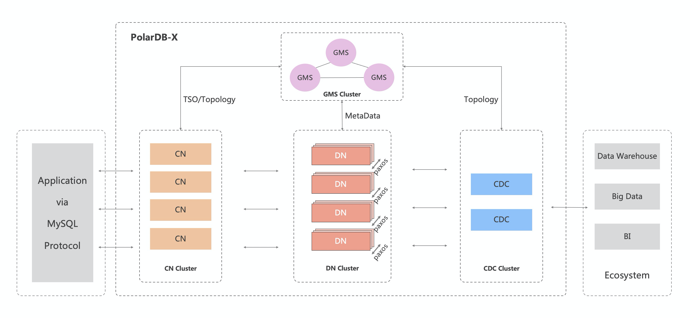

# Product Architecture

PolarDB-X is designed with a shared-nothing and storage-computing separation architecture, and the system consists of 4 core components.

- Compute Node (CN, Compute Node)

The computing node is the entrance of the system, adopts a stateless design, and includes modules such as SQL parser, optimizer, and executor. Responsible for data distributed routing, calculation and dynamic scheduling, responsible for distributed transaction 2PC coordination, global secondary index maintenance, etc., and provides enterprise-level features such as SQL current limiting and separation of three rights.

- Storage node (DN, Data Node)

Storage nodes are responsible for data persistence, providing high data reliability and strong consistency guarantees based on the majority Paxos protocol, and maintaining distributed transaction visibility through MVCC.

- Metadata service (GMS, Global Meta Service)

The metadata service is responsible for maintaining globally consistent Table/Schema, Statistics and other system Meta information, maintaining security information such as accounts and permissions, and providing global timing services (TSO).

- Log node (CDC, Change Data Capture)

The log node provides an incremental subscription capability fully compatible with the MySQL Binlog format and protocol, and a master-slave replication capability compatible with the MySQL Replication protocol.

PolarDB-X provides the management of the above four components through K8S Operator, and at the same time, RPC communication between computing nodes and storage nodes can be carried out through private protocols. The warehouses corresponding to these components are as follows:

| Component Name | Warehouse Address |
| -------------------------------------------- | -------------------------------------------------------- |
| Compute Node （CN, Compute Node） | [galaxysql](https://github.com/ApsaraDB/galaxysql) |
| Metadata Service  (GMS, Global Meta Service) | [galaxyengine](https://github.com/ApsaraDB/galaxyengine) |
| Storage Node （DN, Data Node） | [galaxyengine](https://github.com/ApsaraDB/galaxyengine) |
| Log Node （CDC, Change Data Capture） | [galaxycdc](https://github.com/ApsaraDB/galaxycdc) |
| Private protocol | [galaxyglue](https://github.com/ApsaraDB/galaxyglue) |
| K8S Operator                                 | [galaxykube](https://github.com/ApsaraDB/galaxykube)     |