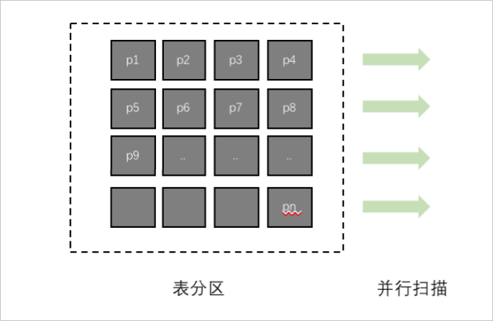

偏分析场景的实践和优化 
================================

PolarDB-X是一款以TP为主的HTAP数据库，也支持一定场景的分析需求。而典型的分析场景一般有以下几类特征：


* 少量的写或者更新请求，大多数是读请求；

* 每次查询都从数据库中读取大量的行，但是同时又仅需要少量的列；

* 大多数查询都是比较复杂的查询，查询的并发不会很大，但单个查询需要高吞吐量；

* 对于简单查询，允许一定的延迟；

* 分析场景上分布式事务可能不是必须的；

* 大部分查询中往往会涉及到事实表和维表的关联，是典型的大小表关联场景；

* 查询结果明显小于源数据，即数据被过滤或聚合后能够被盛放在单台服务器的内存中；

* 分析的数据往往是最近的业务数据，历史数据可以被清理或者被归档。


依据上述对分析场景的归纳，分析场景做性能优化除了要沿用TP数据库的优化思路，还会有自身不一样的优化思路。这主要会体现在结构设计和查询优化两个方面。

结构设计 
-------------------------

在结构设计上主要包括如何选择表类型、分区键、主键、聚簇以及使表的性能达到最优。

**设计为分区表或者广播表**

1. 广播表会在集群的每个数据节点都存储一份数据，建议广播表的数据量不宜太大，每张广播表存储的数据不超过20万行，这样在大表和广播表做关联时，可以计算下推，让关联贴近数据层做计算，避免大表数据拉取到计算节点做计算。

2. 其他业务数据尽可能做成分区表，可以充分利用分布式系统的查询能力。理论上表的分区数量越多越好，这样多个分区表可以做并行扫描。存储层更易做到水平扩展，存储千万条甚至上亿条数据。不过实际使用中建议一个分区表的数量在500w\~5000w之间。




 **选择合适的分区键**

PolarDB-X默认按照主键做分拆，以降低使用分布式数据库的门槛。同时也支持通过指定分区键建分区表，在分析场景建议您根据如下依据选择的分区键：


1. 尽可能选择参与JOIN的字段作为分区键，这样做的目的还是为了关联条件下推，避免数据被拉取到计算层做计算。

2. 尽可能选择值分布均匀的字段作为分区键，这样可以避免由于分布式不均导致出现计算长尾现象，严重托慢大查询性能。


**合理设计二级分区**

PolarDB-X支持二级分区。当数据量过大或者有数据倾斜时，二级分区的选择至关重要，如果数据量大的表中没有二级分区或者二级分区切分不合理，也会影响性能。如果业务明确有增量数据导入需求，主要是对最近数据的报表分析，那么建议用日期格式做二级分区，避免对历史过期数据的扫描。

```sql
//直接用col先做一级分区
PARTITION BY HASH(col) 
SUBPARTITION BY LIST (ds) 
//ds转换后的月做分区
SUBPARTITION TEMPLATE (
   PARTITION p1 VALUES LESS THAN ('2021-08-00'),
   PARTITION p2 VALUES LESS THAN ('2021-09-00'),
)
```

 **合理设计索引**

如果业务已经按照关联字段，合理的设计了分区键。但依然还有部分复杂查询涉及到对该表的其他列做关联，无法做到关联查询下推，此时可以考虑基于该非分区键的列做全局二级索引。这样复杂查询对该表做关联，可以转化成与该全局二级索引做关联。同时了为了避免回表的代价，对于分析场景建议所有的全局二级索引都建成聚簇索引。

查询优化 
-------------------------

在分析场景中，由于会涉及比较大的数据，且对简单查询的延迟有一定的容忍度，推荐您采用MPP执行模式，既利用多个计算节点（CN）的计算资源承担复杂计算。

在查询过程中，PolarDB-X首先会基于优化器选择合适的分布式执行计划，然后将计划调度到各个计算节点，充分发挥整个集群的计算资源加速查询。这个过程生成的分布式执行计划完全是基于统计信息做代价选择，所以及时的信息采集至关重要；同时由于优化器生成的计划不一定是最优的，所以这里也给到您在SQL编写和优化时的经验。

**收集统计信息**

PolarDB-X会及时定时收集统计信息，如果发现PolarDB-X生成的分布式执行计划不是最优的。可以通过ANALYZE TABLE手动对某个表做统计信息收集。

**SQL编写技巧**

* 去掉不必要的列

    由于分析场景大多数是高吞吐的，所以应该去除返回过程中不必要的列，减少对带宽的压力。在编写SQL时一定要确认业务需要返回的列，不要直接使用星号（\*）进行查询。

  ```sql
  //不合适写法
  select * from T1 where a1>100 and a2<1000;
  //更合适写法，只需要返回业务关心的列
  select a1, a2 from T2 where a1>100 and a2<1000;
  ```

   

* 基于局部索引做过滤

    很多分析场景都期望用时间做二级分区，这样做大数据扫描的时候可以把时间做过滤条件，过滤掉绝大多数历史数据。

  ```sql
  select a1,c2 from T1 where time >='2010-01-01 00:00:00';
  ```

  

  为了避免全部扫描，目前默认会在这个分区列上做局部索引。同样的在很多高吞吐的扫描场景下，可以考虑基于过滤条件做局部索引。
  

* 避免低效的SQL语法

    如果表记录数非常大，扫描会很慢，直接导致查询缓慢。所以在SQL编写过程中我们需要注意以下几点：

  第一，避免索引失效
  
  1. 不在索引列上做任何操作，计算、函数、类型转换（自动或手动），会导致索引失效而转向全表扫描。

     ```sql
     mysql> explain execute select * from staffs where name= 'hu';
     +----+-------------+--------+------------+------+-----------------------+-----------------------+---------+-------+------+----------+-------+
     | id | select_type | table  | partitions | type | possible_keys         | key                   | key_len | ref   | rows | filtered | Extra |
     +----+-------------+--------+------------+------+-----------------------+-----------------------+---------+-------+------+----------+-------+
     |  1 | SIMPLE      | staffs | NULL       | ref  | idx_staffs_nameAgePos | idx_staffs_nameAgePos | 74      | const |    1 |      100 | NULL  |
     +----+-------------+--------+------------+------+-----------------------+-----------------------+---------+-------+------+----------+-------+
     1 row in set , 1 warning (0.00 sec)
     //在索引列上做了其他操作，导致索引失效
     mysql> explain execute select * from staffs where left(name,4)= 'hu';
     +----+-------------+--------+------------+------+---------------+------+---------+------+------+----------+-------------+
     | id | select_type | table  | partitions | type | possible_keys | key  | key_len | ref  | rows | filtered | Extra       |
     +----+-------------+--------+------------+------+---------------+------+---------+------+------+----------+-------------+
     |  1 | SIMPLE      | staffs | NULL       | ALL  | NULL          | NULL | NULL    | NULL |  198 |      100 | Using where |
     +----+-------------+--------+------------+------+---------------+------+---------+------+------+----------+-------------+
     1 row in set , 1 warning (0.00 sec)
     ```

      
  
  2. 在使用不等于（！=或\<\>）的时候，无法使用索引导致全表扫描。
  
  3. is null，is not null也无法使用索引。

     ```sql
     mysql>  explain execute select * from staffs where name is null ;
     +----+-------------+-------+------------+------+---------------+------+---------+------+------+----------+------------------+
     | id | select_type | table | partitions | type | possible_keys | key  | key_len | ref  | rows | filtered | Extra            |
     +----+-------------+-------+------------+------+---------------+------+---------+------+------+----------+------------------+
     |  1 | SIMPLE      | NULL  | NULL       | NULL | NULL          | NULL | NULL    | NULL | NULL | NULL     | Impossible WHERE |
     +----+-------------+-------+------------+------+---------------+------+---------+------+------+----------+------------------+
     1 row in set
     ```

      
  
  4. like以通配符开头，mysql索引失效会进行全表扫描的操作。

     ```sql
     mysql>  explain exeucte select * from staffs where name like '%hu' ;
     +----+-------------+--------+------------+------+---------------+------+---------+------+------+----------+-------------+
     | id | select_type | table  | partitions | type | possible_keys | key  | key_len | ref  | rows | filtered | Extra       |
     +----+-------------+--------+------------+------+---------------+------+---------+------+------+----------+-------------+
     |  1 | SIMPLE      | staffs | NULL       | ALL  | NULL          | NULL | NULL    | NULL |  198 |    11.11 | Using where |
     +----+-------------+--------+------------+------+---------------+------+---------+------+------+----------+-------------+
     1 row in set
     mysql>  explain execute select * from staffs where name like 'hu%' ;
     +----+-------------+--------+------------+-------+-----------------------+-----------------------+---------+------+------+----------+-----------------------+
     | id | select_type | table  | partitions | type  | possible_keys         | key                   | key_len | ref  | rows | filtered | Extra                 |
     +----+-------------+--------+------------+-------+-----------------------+-----------------------+---------+------+------+----------+-----------------------+
     |  1 | SIMPLE      | staffs | NULL       | range | idx_staffs_nameAgePos | idx_staffs_nameAgePos | 74      | NULL |    1 |      100 | Using index condition |
     +----+-------------+--------+------------+-------+-----------------------+-----------------------+---------+------+------+----------+-----------------------+
     1 row in set
     ```

      
  

  

  第二，尽量少用like，like操作一般不会很高效，尽量使用范围条件到达目的。比如between...and...

  第三，多表关联场景下：
  
  1. 尽量包含分区列条件。如果不包含，则尽量通过WHERE条件过滤掉多余的数据。
  
  2. outer join的on和where作用域不同。on是作用于join的过程，where是作用于join之后的结果，所以应该将能在join的时候提前过滤的条件写在on上，也可以写在join表的子查询里，这样可以减少join原始表的数据量。
  

  

  


 **数据倾斜的检查和处理**

如果出现查询异常缓慢，或者资源利用率不均匀的情况，则需要确认是否出现了数据倾斜。一般解决倾斜有三种策略：


1. 通过`show info from table`检查某个分片在各个节点上的数据分布计数，如果各节点上的数据分布明显不均匀，则可以考虑对该表的分区键进行调整。

2. 如果是出现了严重Join Key热点问题，将倾斜的Key用单独的逻辑来处理。例如两边的Key中有大量NULL数据导致了倾斜，则需要在Join前先过滤掉NULL数据或者补上随机数，然后再进行Join，示例如下。

   ```sql
   SELECT * FROM A JOIN B ON CASE WHEN A.value IS NULL THEN CONCAT('value',RAND() ) ELSE A.value END = B.value;
   ```

   

   在实际场景中，如果您发现已经数据倾斜，但无法获取导致数据倾斜的Key信息，可以使用如下方法查看数据倾斜。
   

   ```sql
   --执行如下语句查询数据倾斜。
   SELECT * FROM a JOIN b ON a.key=b.key;  
   --您可以执行如下SQL，查看Key的分布，判断执行Join操作时是否会有数据倾斜。
   SELECT left.key, left.cnt * right.cnt FROM 
   (select key, count(*) AS cnt FROM a GROUP BY key) LEFT 
   JOIN
   (SELECT key, COUNT(*) AS cnt FROM b GROUP BY key) RIGHT
   ON left.key=right.key;
   ```

   

   

3. 如果Group By Key出现了热点问题，可以考虑对SQL进行改写，添加随机数，把长Key进行拆分。例如：

   ```sql
   SELECT Key,COUNT(*) AS Cnt FROM TableName GROUP BY Key;
   //优化成以下SQL，先对热点做打散预聚合，再做最终聚合
   -- 假设长尾的Key已经找到是KEY001。
   SELECT a.Key
     , SUM(a.Cnt) AS Cnt
   FROM (
     SELECT Key
       , COUNT(*) AS Cnt
   FROM TableName
   GROUP BY Key, 
     CASE 
       WHEN Key = 'KEY001' THEN rand() % 50
       ELSE 0
      END
   ) a
   GROUP BY a.Key;
   ```

    


调整执行策略 
---------------------------

按照上述策略调整后，查询性能依然不理想且计算和存储资源都未到达瓶颈，这个时候可以调整下执行策略。主要有两种方式去调整：


1. 加大并发度，您可以通过HINT` /*+TDDL:MPP_PARALLELISM=4*/` 指定MPP执行器并行度。

   ```sql
   mysql> /*+TDDL:TDDL:MPP_PARALLELISM=4*/ select a.k, count(*) cnt from sbtest1 a, sbtest1 b where a.id = b.k and a.id > 1000 group by k having cnt > 1300 or
   der by cnt limit 5, 10;
   ```

    

2. 通过HINT指定特定的算法，如何调整更好的聚合算法和关联算法，请参见[聚合](t2117730.html#concept-2117730)和[关联](t2117728.html#concept-2117728)。


