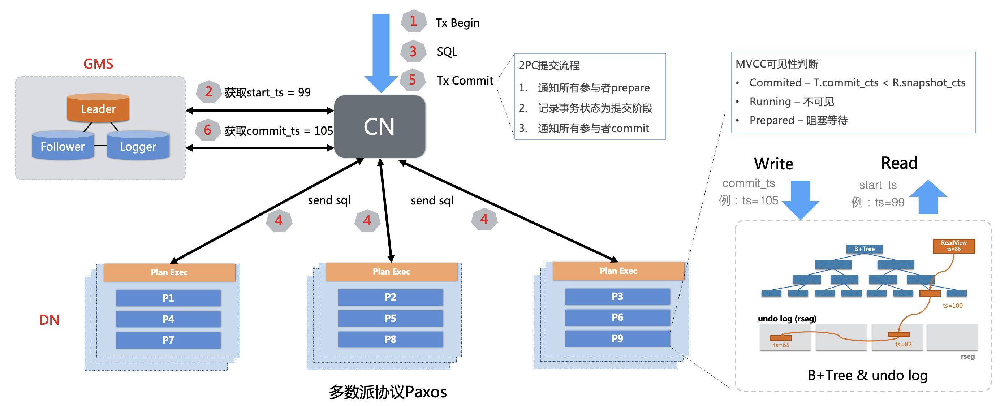

# 分布式事务 

## ACID分布式事务 

PolarDB-X原生支持分布式事务，并保证事务的ACID性质。

* 原子性（Atomicity）

* 一致性（Consistency）

* 隔离性（Isolation）

* 持久性（Durability）


PolarDB-X通过引入中心授时节点（TSO），结合多版本并发控制（MVCC），确保读取到一致的快照，而不会读到事务的中间状态。如下图所示，提交事务时，计算节点（CN）执行事务时从TSO获取到时间戳，随着数据一同提交到存储节点（DN）多版本存储引擎上，读取时CN通过读取快照时间戳去DN上读取相应版本的数据。



## TSO全局时钟 

PolarDB-X分布式事务支持MVCC多版本，分布式的版本号依赖于全局时钟服务来生成全局单调递增的时间戳，基于全局时钟作为版本来提供事务的一致性读取。

PolarDB-X元数据服务（GMS）基于Paxos共识协议提供一个具备三节点高可用性的服务，PolarDB-X的计算节点（CN）会通过RPC接口和元数据服务（GMS）进行通讯并获取全局时钟。

## 事务2PC提交 

以转账场景为例，假设用户账户是一张分区表，那么同一笔转账交易的转入方和转出方很可能位于不同的数据节点上，因此需要分布式事务来保证转账结果正确。

```unknow
BEGIN;
UPDATE account SET balance = balance - 20 WHERE name = 'Alice';
UPDATE account SET balance = balance + 20 WHERE name = 'Bob';
COMMIT;
```


如果事务内写入的数据涉及多个分区，PolarDB-X的计算节点将会使用两阶段提交（2PC）方式提交事务，即便在事务提交过程中发生节点宕机等问题，基于2PC的事务恢复机制也能确保事务原子性。

## MVCC多版本 

以上面的转账场景为例，如何在转账的同时查询所有账户的余额总额（"对账"）：

```unknow
SELECT SUM(balance) FROM account;
```


因查询操作的数据涉及多个分区，PolarDB-X首先会获取全局时钟作为读取版本，读取过程中会对每行数据的MVCC多版本进行可见性判断，确保只会读取在全局时间戳之前已完成提交的事务。

比如转账事务在数据节点的提交有先后时间差，已提交的分支事务因为数据版本号不满足可见性，正在提交的事务数据全部不可见，从而确保总额数据读取的一致性。

## 分布式事务的下游生态 

### 读写分离的一致性（WIP）

事务型的分布式数据库一般会采用读写分离的模式提升读的性能，因此分布式事务除了保障主库的一致性以外，还需要保证用户在使用读写分离模式下对于备库的一致性。

PolarDB-X产品上支持主实例和只读实例，主实例由基于Paxos多数派的Leader/Follower角色组成，只读实例由基于Paxos的Learner角色组成。PolarDB-X针对分布式事务一致性的设计，除了在存储节点（DN）的leader主副本中保存事务信息之外，也会将数据的事务多版本信息同步到learner副本中，可以保证只读实例上的多个分区数据读的一致性，具体特性请参见[混合负载HTAP](HTAP.md)。

例如，用户向主库里写入了一个版本为100的数据，而下一次的查询中带着全局时钟返回的版本为101。当查询被路由到只读的learner节点时，即使learner节点有数据复制延迟，PolarDB-X也可以阻塞读来满足读的一致性。

### 全局变更日志CDC

事务型的分布式数据库除了面向在线业务的高并发写入以外，一般还需要将在线数据同步给下游的灾备数据、汇聚业务、或数据仓库系统等，下游业务对于事务日志的一致性也有比较强的诉求，例如事务不能乱序、事务原子性、DDL支持同步等。

MySQL binlog是MySQL数据库中记录变更数据的"二进制日志"，它可以看做是一个消息队列，队列中按顺序保存了MySQL中详细的增量变更信息，通过消费队列中的变更条目，下游系统或工具实现了与MySQL的实时数据同步，这样的机制也称为CDC（Change Data Capture，增量数据捕捉）。

PolarDB-X存储节点（DN）在变更日志设计上也会保存分布式事务信息，通过PolarDB-X日志组件（CDC）收集分布式下多个存储节点（DN）的日志流，进行收集、重组、排序、落盘等过程，提供满足分布式事务一致性语义的"二进制日志"，并全面兼容MySQL binlog协议和生态。具体特性请参见[全局日志变更CDC](global-binlog.md)。

### 备份恢复的一致性（WIP）

关系型数据库一般会采用数据库的全量备份来保证数据安全。在遇到数据异常、库表误删等风险时，需要通过数据库的备份集进行快速恢复，其中数据恢复需要保证事务的一致性。另外，分布式数据库通常数据存储规模更大，对于备份恢复有更大的挑战。

PolarDB-X在存储节点（DN）的数据和变更日志中都保存了分布式事务的全局时钟（包含了时间戳信息），任意时间点的数据恢复（PITR，point-in-time recovery）都可以快速将时间戳转化为分布式的全局时钟，在备份恢复中按数据的版本可见性进行处理，同时PolarDB-X结合分布式的多节点并行来提升备份恢复的效率。
PolarDB-X 后续将开放 PITR 相关的工具，其原理介绍可参考[《PolarDB-X 备份恢复原理介绍》](https://zhuanlan.zhihu.com/p/429977533) 。
