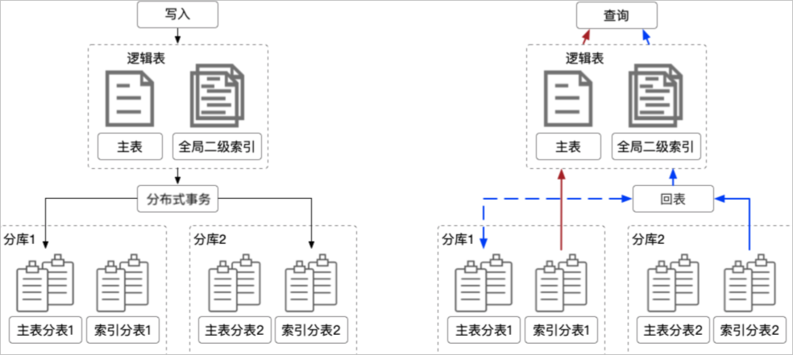

全局二级索引 
===========================

全局二级索引（Global Secondary Index，GSI）是PolarDB-X中的一项重要特性，相比于本地二级索引，全局二级索引中的数据按照指定的拆分方式分布在各个存储节点上。通过全局二级索引，用户能够按需增加拆分维度、提供全局唯一约束等。

每个GSI对应一张分布式索引表，和其他分布式表一样，按照指定的分区规则水平拆分为多张物理表。PolarDB-X使用分布式事务维护主表和索引表之间数据强一致。

全局二级索引还支持以下特性：

* 支持选择覆盖列，减少回表操作开销。

* 在线表结构变更，添加GSI不锁主表。

* 支持通过HINT指定索引，自动判断是否需要回表。

示例1：增加拆分维度。例如，对于在线商城的订单表，假设按照买家用户维度拆分，那么对于卖家查询（例如，查询某个卖家的本月所有订单）就需要扫描所有分区。但是借助全局二级索引，可以仅仅扫描相应卖家所在的索引表分区，快速找到所需的订单信息。

示例2：全局唯一约束。例如，假设用户表是一张分布式表，按照用户ID分区。若要求用户手机号需要全局唯一，那么本地索引无法满足，必须构建一个按手机号作为索引键（同时也是分区键）的唯一索引。
