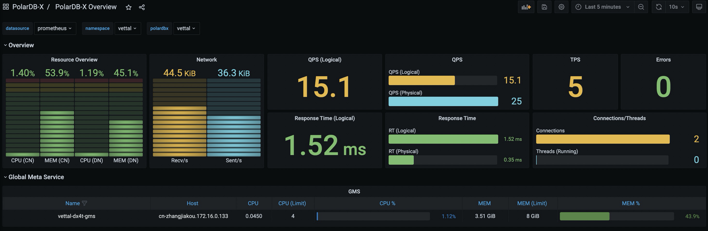

# Database monitoring

This section describes how to enable the monitoring function for the PolarDB-X database in the Kubernetes cluster.

## Install PolarDB-X Monitor

PolarDB-X monitors the PolarDB-X cluster through Prometheus and Grafana. PolarDB-X Monitor integrates the [kube-promethus](https://github.com/prometheus-operator/kube-prometheus) component stack. By installing PolarDB-X Monitor, you can deploy the resources and components required for monitoring with one click.

### precondition

- A running Kubernetes cluster has been prepared and the cluster version is 1.18.0 or above.

- [Helm 3](https://helm.sh/docs/intro/install/) has been installed.

- PolarDB-X Operator of version 1.2.0 or above has been installed.

### Install the Helm package

1. First create a namespace called polardbx-monitor:

```bash
kubectl create namespace polardbx-monitor
```

2. Install the PolarDB-X Monitor CRD:

```bash
kubectl apply -f https://raw.githubusercontent.com/ApsaraDB/galaxykube/v1.2.1/charts/polardbx-operator/crds/polardbx.aliyun.com_polardbxmonitors.yaml
```

> **Note**:
>
> - If your PolarDB-X Operator 1.2.0 is installed directly through helm install, the CRD of PolarDB-X Monitor will be installed by default, and this step can be skipped. If your PolarDB-X Operator is upgraded from a lower version of 1.1.0 and below through helm upgrade, you need to execute the following command to manually install PolarDB-X Monitor:
>
> ```bash
> helm install --namespace polardbx-monitor polardbx-monitor https://github.com/ApsaraDB/galaxykube/releases/download/v1.2.1/polardbx-monitor-1.2.1.tgz
> ```
>
> - You can also install from PolarDB-X's Helm Chart repository:
>
> ```shell
> helm repo add polardbx https://polardbx-charts.oss-cn-beijing.aliyuncs.com
> helm install --namespace polardbx-monitor polardbx-monitor polardbx/polardbx-monitor
> ```
>
> - Installing Prometheus and Grafana in this way adopts the default configuration, which is convenient for quick experience. If it is deployed in a production cluster, you can refer to [Customize Prometheus and Grafana configuration](monitor.md#Customize Prometheus and Grafana configuration).
> - If you are installing PolarDB-X Monitor on minikube, the component may not be created due to insufficient resources. You can refer to [Configure Prometheus and Grafana Specifications] (monitor.md#Configure Prometheus and Grafana Specifications) to adjust the component specifications.

Expect to see output like this:

```bash
polardbx-operator monitor plugin is installed. Please check the status of components:

kubectl get pods --namespace {{ .Release.Namespace }}

Now start to monitor your polardbx cluster.
```

3. After the PolarDB-X Monitor is installed, components such as Prometheus and Grafana will be created under the polardbx-monitor namespace of your Kubernetes cluster to monitor PolarDB-X in Kubernetes. You can run the following command to check whether the relevant components are normal and confirm that all Pods are in the Running state.

```bash
kubectl get pods -n polardbx-monitor
```

## Enable PolarDB-X monitoring

The monitoring collection function of the PolarDB-X cluster is disabled by default. You need to create a PolarDB-X Monitor object for the PolarDB-X Cluster you need to monitor to enable it.

```bash
kubectl apply -f polardbx-monitor.yaml
```

The description of polardbx-monitor.yaml is as follows:

```yaml
apiVersion: polardbx.aliyun.com/v1
kind: PolarDBXMonitor
Metata:
name: quick-start-monitor
spec:
clusterName: quick-start
monitorInterval: 30s
scrapeTimeout: 10s
```

- spec.clusterName: the name of the PolarDB-X cluster that needs to be monitored
- spec.monitorInterval: Monitoring data collection frequency, default 30s
- spec.scrapeTimeout: The timeout period for monitoring data collection, the default is 10s

## Access Grafana Dashboard

By default, execute the following command to forward the Grafana port to the local:

```bash
kubectl port-forward svc/grafana -n polardbx-monitor 3000
```

Enter <http://localhost:3000> in the browser to access PolarDB-X Dashboard. The default username and password are both admin.

> **Note**: Since the Grafana configuration is stored in the ConfigMap, the password you modified in Grafana or the newly added Dashboard will not be persisted. Once the Grafana Pod is rebuilt, this part of the configuration will be lost. Please save it in advance.



If your Kubernetes cluster supports LoadBalancer, you can configure LoadBalancer for Grafana's Service to access. For details, see: [Configure LoadBalancer](monitor.md#Configure LoadBalancer).

If there are multiple PolarDB-X Clusters in your Kubernetes cluster, you can switch between Namespace and PolarDB-X Cluster through the drop-down box on the Grafana page.

## Access Prometheus

By default, execute the following command to forward the Prometheus port to the local:

```bash
kubectl port-forward svc/prometheus-k8s -n polardbx-monitor 9090
```

Enter <http://localhost:9090> in the browser to access the Prometheus page.

If your Kubernetes cluster supports LoadBalancer, you can configure LoadBalancer for the Prometheus Service to access, see [Configure LoadBalancer](monitor.md#Configure LoadBalancer) for details.

## Customize Prometheus and Grafana configuration

The helm chart of PolarDB-X Monitor uses the default Prometheus and Grafana configurations. If you want to modify the relevant configurations, you can use the following commands to install or upgrade PolarDB-X Monitor, and override the default configurations through values.yaml.

```bash
helm install --namespace polardbx-monitor polardbx-monitor polardbx-monitor-1.2.0.tgz -f values.yaml
```

or:

```bash
helm upgrade --namespace polardbx-monitor polardbx-monitor polardbx-monitor-1.2.0.tgz -f values.yaml
```

The values.yaml file contains configuration items related to Prometheus and Grafana. The following configuration examples are given for several common scenarios. For a detailed configuration list, see [values.yaml](https://raw.githubusercontent.com/ApsaraDB/ galaxykube/v1.2.0/charts/polardbx-monitor/values.yaml).

### Configure LoadBalancer

If your Kubernetes cluster supports LoadBalancer, you can use the `-f` parameter to specify the following configuration when installing or upgrading PolarDB-X Monitor:

```yaml
monitors:
grafana:
serviceType: LoadBalancer
prometheus:
serviceType: LoadBalancer
```

### Persistent monitoring data

The monitoring data of the Prometheus cluster created by the default configuration is not persistent, and there is a risk of data loss. You can specify the directory for data persistence through the following values.yaml

```yaml
monitors:
prometheus:
persist: true
# The storage class supported in the Kubernetes cluster
storageClassName: ssd
# The size of the storage space
storageRequest: 100G
```

### Configure Prometheus and Grafana specifications

In the default configuration, the Prometheus cluster contains 1 node, and each node is limited to 8C16G resources. Grafana contains 1 node, and each node is limited to 4C8G resources. You can modify the specifications and number of nodes of Prometheus and Grafana clusters through the following configuration items:

```yaml
monitors:
grafana:
resources:
requests:
cpu: 1000m
memory: 2Gi
limits:
cpu: 2000m
memory: 8Gi
prometheus:
resources:
requests:
cpu: 1000m
memory: 2Gi
limits:
cpu: 2000m
memory: 8Gi
```