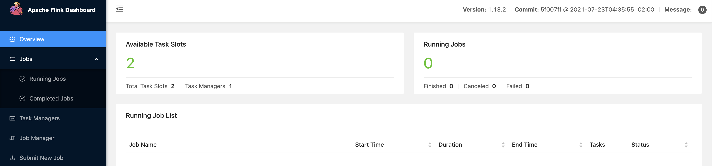

# Subscribe to PolarDB-X CDC with Elasticsearch

This section describes how to import data to Elasticsearch through PolarDB-X with Flink-CDC.

## Prepare components

We assume you are running on a MacOS or Linux machine and have Docker installed.

### Configure container

Configure `docker-compose.yml`.

```yaml
version: '2.1'
services:
polardbx:
polardbx:
image: polardbx/polardb-x:2.0.1
container_name: polardbx
ports:
- "8527:8527"
elasticsearch:
image: 'elastic/elasticsearch:7.6.0'
container_name: elasticsearch
environment:
- cluster.name=docker-cluster
- bootstrap.memory_lock=true
- ES_JAVA_OPTS=-Xms512m -Xmx512m
- discovery.type=single-node
ports:
- '9200:9200'
- '9300:9300'
ulimits:
memlock:
soft: -1
hard: -1
nofile:
soft: 65536
hard: 65536
kibana:
image: 'elastic/kibana:7.6.0'
container_name: kibana
ports:
- '5601:5601'
volumes:
- '/var/run/docker.sock:/var/run/docker.sock'
```

The containers included in this Docker Compose are:

- PolarDB-X: The product table `products` and the order table `orders` will be stored in this database, and the two tables will be associated to get an order table `enriched_orders` that contains more information.
- Elasticsearch: The final order table `enriched_orders` will be written to Elasticsearch.
- Kibana: Used to visualize ElasticSearch data.

### Start the container

In the directory where `docker-compose.yml` is located, execute the following command to start the required components:

```bash
docker-compose up -d
```

This command will automatically start all containers defined in the Docker Compose configuration in detached mode. You can use the `docker ps` command to observe whether the above container is started normally, or visit <http://localhost:5601/> to check whether Kibana is running normally.

## Prepare data

Log in to PolarDB-X with the created username and password.

```bash
mysql -h127.0.0.1 -P8527 -upolardbx_root -p"123456"
```
```sql
CREATE DATABASE mydb;
USE mydb;

-- Create a product table and write some data
CREATE TABLE products (
id INTEGER NOT NULL AUTO_INCREMENT PRIMARY KEY,
name VARCHAR(255) NOT NULL,
description VARCHAR(512)
) AUTO_INCREMENT = 101;

INSERT INTO products
VALUES (default,"scooter","Small 2-wheel scooter"),
(default,"car battery","12V car battery"),
(default,"12-pack drill bits","12-pack of drill bits with sizes ranging from #40 to #3"),
(default,"hammer","12oz carpenter's hammer"),
(default,"hammer","14oz carpenter's hammer"),
(default,"hammer","16oz carpenter's hammer"),
(default,"rocks","box of assorted rocks"),
(default,"jacket","water resistant black windbreaker"),
(default,"spare tire","24 inch spare tire");


-- Create an order table and write some data
CREATE TABLE orders (
order_id INTEGER NOT NULL AUTO_INCREMENT PRIMARY KEY,
order_date DATETIME NOT NULL,
customer_name VARCHAR(255) NOT NULL,
price DECIMAL(10, 5) NOT NULL,
product_id INTEGER NOT NULL,
order_status BOOLEAN NOT NULL -- Whether order has been placed
) AUTO_INCREMENT = 10001;

INSERT INTO orders
VALUES (default, '2020-07-30 10:08:22', 'Jark', 50.50, 102, false),
(default, '2020-07-30 10:11:09', 'Sally', 15.00, 105, false),
(default, '2020-07-30 12:00:30', 'Edward', 25.25, 106, false);
```

## Download Flink and the required dependencies

1. Download [Flink 1.13.2](https://archive.apache.org/dist/flink/flink-1.13.2/flink-1.13.2-bin-scala_2.11.tgz) and extract it to the directory `flink-1.13.2`.

2. Download the following dependencies and put them in the directory `flink-1.13.2/lib/`.

> **Note:** The download link is only valid for the released version, and the SNAPSHOT version needs to be compiled locally.


- 用于订阅PolarDB-X Binlog：[flink-sql-connector-mysql-cdc-2.3-SNAPSHOT.jar](https://repo1.maven.org/maven2/com/ververica/flink-sql-connector-mysql-cdc/2.3-SNAPSHOT/flink-sql-connector-mysql-cdc-2.3-SNAPSHOT.jar)
- 用于写入Elasticsearch：[flink-sql-connector-elasticsearch7_2.11-1.13.2.jar](https://repo.maven.apache.org/maven2/org/apache/flink/flink-sql-connector-elasticsearch7_2.11/1.13.2/flink-sql-connector-elasticsearch7_2.11-1.13.2.jar)

3. Start the Flink service:
```shell
./bin/start-cluster.sh
```

Visit <http://localhost:8081/> to check whether Flink is running normally:



4. Start Flink SQL CLI: `shell ./bin/sql-client.sh`

## Create tables using Flink DDL in Flink SQL CLI

```bash
-- Set the interval time to 3 seconds
Flink SQL> SET execution.checkpointing.interval = 3s;

-- Create source1 (order table)
Flink SQL> CREATE TABLE orders (
order_id INT,
order_date TIMESTAMP(0),
customer_name STRING,
price DECIMAL(10, 5),
product_id INT,
order_status BOOLEAN,
PRIMARY KEY (order_id) NOT ENFORCED
) WITH (
'connector' = 'mysql-cdc',
'hostname' = '127.0.0.1',
'port' = '8527',
'username' = 'polardbx_root',
'password' = '123456',
'database-name' = 'mydb',
'table-name' = 'orders'
);

-- Create source2 (product table)
CREATE TABLE products (
id INT,
name STRING,
description STRING,
PRIMARY KEY (id) NOT ENFORCED
) WITH (
'connector' = 'mysql-cdc',
'hostname' = '127.0.0.1',
'port' = '8527',
'username' = 'polardbx_root',
'password' = '123456',
'database-name' = 'mydb',
'table-name' = 'products'
);

-- Create sink (associated result table)
Flink SQL> CREATE TABLE enriched_orders (
order_id INT,
order_date TIMESTAMP(0),
customer_name STRING,
price DECIMAL(10, 5),
product_id INT,
order_status BOOLEAN,
product_name STRING,
product_description STRING,
PRIMARY KEY (order_id) NOT ENFORCED
) WITH (
'connector' = 'elasticsearch-7',
'hosts' = 'http://localhost:9200',
'index' = 'enriched_orders'
);

-- perform read and write
Flink SQL> INSERT INTO enriched_orders
SELECT o.order_id,
o.order_date,
o.customer_name,
o.price,
o.product_id,
o.order_status,
p.name,
p.description
FROM orders AS o
LEFT JOIN products AS p ON o.product_id = p.id;
```

## View data in Kibana

Visit <http://localhost:5601/app/kibana#/management/kibana/index_pattern>, create index pattern `enriched_orders`, and then you can see it in <http://localhost:5601/app/kibana#/discover> The data written.

## Modify the monitoring table data and view incremental data changes

Perform the following modification operations in PolarDB-X in sequence, refresh Kibana every step, and you can see that the order data displayed in Kibana will be updated in real time.

```sql
INSERT INTO orders VALUES (default, '2020-07-30 15:22:00', 'Jark', 29.71, 104, false);

UPDATE orders SET order_status = true WHERE order_id = 10004;

DELETE FROM orders WHERE order_id = 10004;
```

## Clean up the environment

In the directory where the `docker-compose.yml` file is located, execute the following command to stop all containers:

```bash
docker-compose down
```

Enter the deployment directory of Flink and stop the Flink cluster:

```bash
./bin/stop-cluster.sh
```