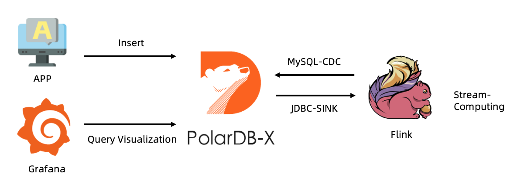
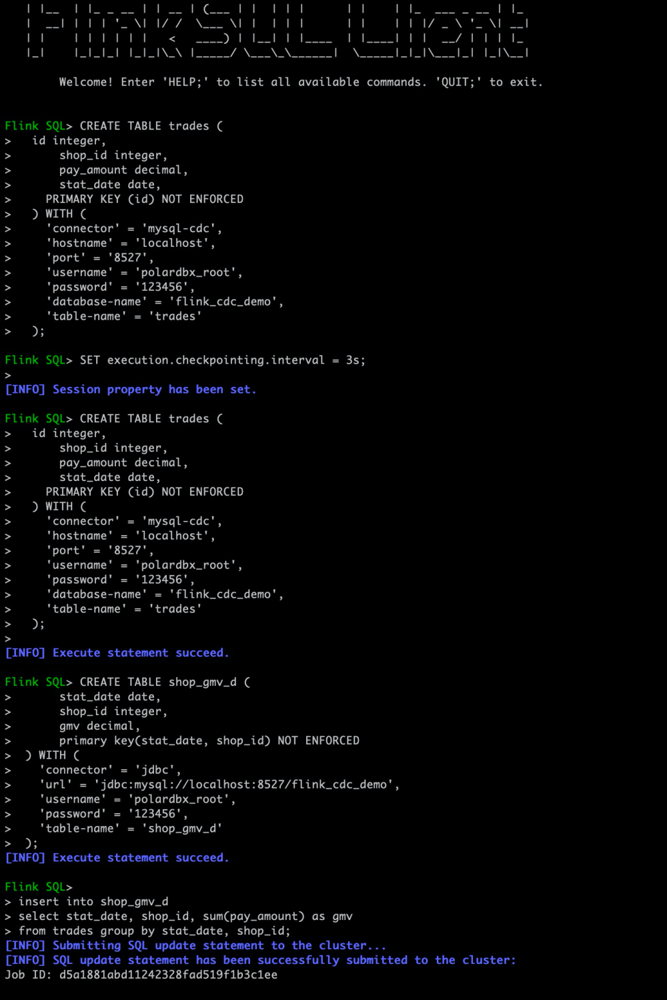
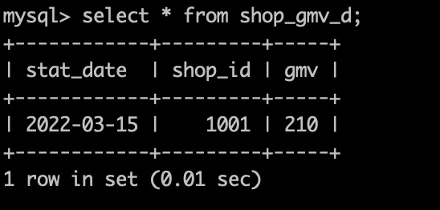
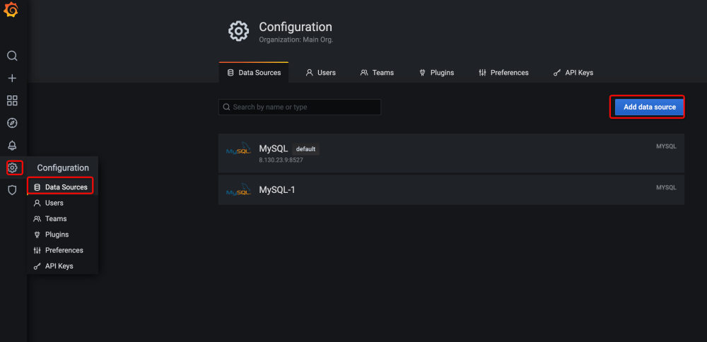
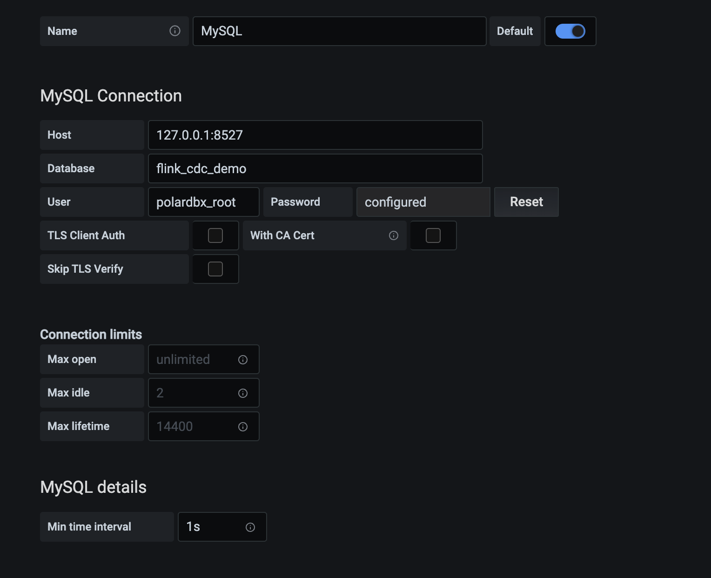
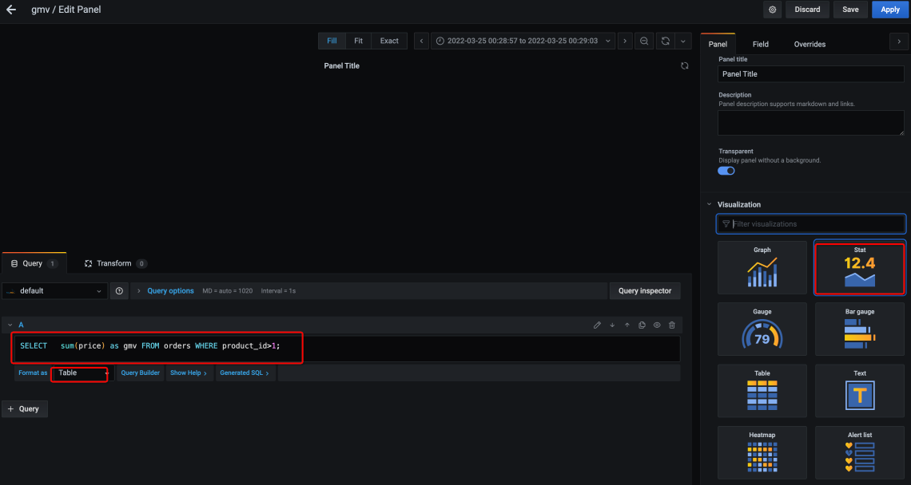
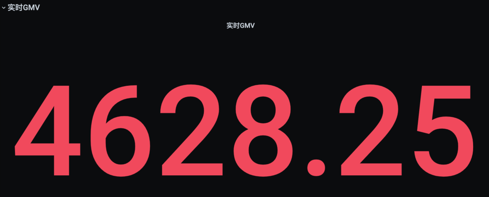

# Subscribe to PolarDB-X CDC using Flink

This section introduces how to subscribe to the incremental data of PolarDB-X in real time through Flink, and build a real-time data large screen through a simple configuration example (zero code).



## Demonstration environment description

It is recommended to operate on a MacOS or Linux machine.

**Environment Release Notes:**

| Examples | Release Notes |
| :-------- | :------- |
| PolarDB-X | >= 2.0.1 |
| Flink | >=1.13.6 |
| Flink-CDC | >= 2.2   |

## Prepare the PolarDB-X environment

### Install PolarDB-X

If you have already installed the Docker environment, please execute the following script to complete the installation of PolarDB-X, which takes about 1-2 minutes.

```bash
# Get PolarDB-X image
docker pull polardbx/polardb-x:2.0.1

# Start PolarDB-X, and expose port 8527, it may take 1-2 minutes
docker run -d --name polardbx-play -p 8527:8527 polardbx/polardb-x

# Start with MySQL client authentication
mysql -h127.1 -P8527 -upolardbx_root -p"123456"
```

> **Note**: PolarDB-X cluster deployment methods include PXD, Kubernetes, etc. For details, please refer to [Quick Start](../../quickstart/topics/Quick-Start.md).

## Prepare the Flink environment

- Install Flink
- Download Flink Connector (jar package)
- Connector for MySQL-CDC: Subscribe to PolarDB-X Binlog
- Connector For Jdbc: for Jdbc writing
- Connector For MySQL: used to support MySQL writing

```bash
# Download the Flink installation package and decompress it
wget https://dlcdn.apache.org/flink/flink-1.13.6/flink-1.13.6-bin-scala_2.11.tgz
his-sjbf-falling-1.13.6-bin-scale_2.ga.brain

# Flink's plugins are stored in the ${FLINK_HOME}/lib directory in the form of jar packages
cd flink-1.13.6/lib

# Download the Flink-CDC plugin for subscribing to incremental logs
wget https://repo1.maven.org/maven2/com/ververica/flink-sql-connector-mysql-cdc/2.2.0/flink-sql-connector-mysql-cdc-2.2.0.jar

# Download the Flink-JDBC plug-in Flink-MySQL driver for writing to PolarDB-X
wget https://repo.maven.apache.org/maven2/org/apache/flink/flink-connector-jdbc_2.11/1.13.6/flink-connector-jdbc_2.11-1.13.6.jar
wget https://repo.maven.apache.org/maven2/mysql/mysql-connector-java/8.0.28/mysql-connector-java-8.0.28.jar

# Go back to ${FLINK_HOME} and start the Flink server separately
cd ..
./bin/start-cluster.sh
```

> For more details about Flink, please visit [Flink official website](https://flink.apache.org/) and [Flink-CDC official website](https://ververica.github.io/flink-cdc-connectors) .

## Prepare data

### Prepare PolarDB-X data

- trades table: simulated transaction table, used to simulate user payment behavior
- shop_gmv_d table: real-time statistical table of simulated transaction amount, used to count the transaction amount of the day

```sql
# Login to PolarDB-X
mysql -h127.1 -P8527 -upolardbx_root -p"123456"

# create database
create database flink_cdc_demo;
use flink_cdc_demo;

# order form
create table `trades` (
id integer auto_increment NOT NULL,
shop_id integer comment 'shop id',
pay_amount decimal comment 'payment amount',
stat_date date comment 'statistical time',
primary key(id)
) comment = 'transaction table' dbpartition by hash(id);

# Simulate the user's payment behavior, here it is assumed that the amount of each order is 10
insert trades values(default, 1001, 10, '2022-03-15');
insert trades values(default, 1001, 10, '2022-03-15');
insert trades values(default, 1001, 10, '2022-03-15');
insert trades values(default, 1001, 10, '2022-03-15');
insert trades values(default, 1001, 10, '2022-03-15');

# Receive GMV written by Flink
create table `shop_gmv_d` (
stat_date date comment 'statistical time',
shop_id integer comment 'shop id',
gmv decimal comment 'total turnover',
primary key(stat_date, shop_id)
) comment = 'Shop 1 day real-time transaction amount';
```

### Prepare Flink test table

```bash
# Log in to the Flink client
./bin/sql-client.sh

# Set the check point interval to 3s
SET 'execution.checkpointing.interval' = '3s';

# Create a Flink source table for subscribing to PolarDB-X incremental data
CREATE TABLE trades (
id integer,
shop_id integer,
pay_amount decimal,
stat_date date,
PRIMARY KEY (id) NOT ENFORCED
) WITH (
'connector' = 'mysql-cdc',
'hostname' = 'localhost',
'port' = '8527',
'username' = 'polardbx_root',
'password' = '123456',
'database-name' = 'flink_cdc_demo',
'table-name' = 'trades'
);

# Observe the data changes of PolarDB-X
select * from trades;

# Create a Flink sink table for writing statistical data back to PolarDB-X

CREATE TABLE shop_gmv_d (
stat_date date,
shop_id integer,
gmv decimal,
primary key(stat_date, shop_id) NOT ENFORCED
) WITH (
'connector' = 'jdbc',
'url' = 'jdbc:mysql://localhost:8527/flink_cdc_demo',
'username' = 'polardbx_root',
'password' = '123456',
'table-name' = 'shop_gmv_d'
);

# Calculate the total turnover of 1 day in real time and write it back to PolarDB-X
insert into shop_gmv_d
select stat_date, shop_id, sum(pay_amount) as gmv
from trades group by stat_date, shop_id;
```

Example screenshot:



Log in to PolarDB-X to verify Flink write results:

```sql
# Login to PolarDB-X
mysql -h127.1 -P8527 -upolardbx_root -p"123456"

# switch database
use flink_cdc_demo;

# Observe the transaction amount change
select * from shop_gmv_d;

# Continue to simulate the user's order behavior
insert trades values(default, 1001, 10, '2022-03-15');
insert trades values(default, 1001, 10, '2022-03-15');
insert trades values(default, 1001, 10, '2022-03-15');
insert trades values(default, 1001, 10, '2022-03-15');
insert trades values(default, 1001, 10, '2022-03-15');

# Observe the transaction amount change
select * from shop_gmv_d;
```

Continuing to simulate the payment behavior of trades, it can be observed that the value of GMV is constantly increasing:



## Configure Grafana

You can observe data changes more intuitively by using visualization tools.

### Download Grafana

```bash
# Download Grafana
wget https://mirrors.huaweicloud.com/grafana/7.1.5/grafana-7.1.5.darwin-amd64.tar.gz

# unzip
tar -xzvf grafana-7.1.5.darwin-amd64.tar.gz
cd grafana-7.1.5
```

### Change parameters

Change the default refresh interval from 5s to 60ms, so that the chart can be refreshed in real time:

```bash
vi conf/defaults.ini
# Change parameters
min_refresh_interval = 60ms

# start Grafana
./bin/grafana-server web
```

Access the Grafana console [http://localhost:3000](http://localhost:3000/) (the default username and password are both admin).

### Configure Dashboard

Click "Configuration" -> "Data Sources" -> "Add data source" to add a new data source.





Add Dashboard and modify the configuration:

- Visualization: select "Stat"
- SQL: Enter "select gmv from shop_gmv_d"
- Format: set to "Table"



Refresh data in real time:

