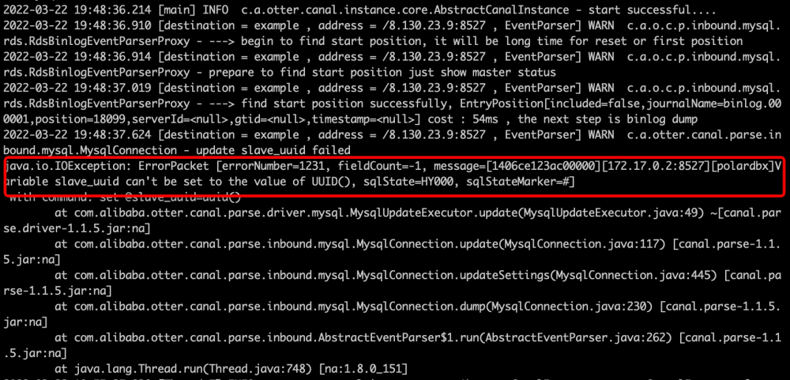

# Use Kafka to subscribe to PolarDB-X CDC

This section describes how to subscribe to PolarDB-X incremental data through Canal and deliver it to Kafka for consumption.

## Demonstration environment description

It is recommended to operate on a MacOS or Linux machine.

**Environment Release Notes:**

| Example | Release Notes | Official Website |
| :-------- | :------- | :---------------------------------------- |
| PolarDB-X | 2.0.1    | [PolarDB-X](https://polardbx.com/)        |
| Kafka     | 2.13     | [Kafka](https://kafka.apache.org/)        |
| Canal     | 1.1.5    | [Canal](https://github.com/alibaba/canal) |

## Prepare PolarDB-X

If you have already installed Docker, please execute the following script to complete the installation of the stand-alone version of PolarDB-X, which takes about 1-2 minutes.

```bash
# Get PolarDB-X image
docker pull polardbx/polardb-x:2.0.1

# Start PolarDB-X, and expose port 8527, it may take 1-2 minutes
docker run -d --name polardbx-play -p 8527:8527 polardbx/polardb-x

# Start with MySQL client authentication
mysql -h127.1 -P8527 -upolardbx_root -p"123456"
```

> **Note**: PolarDB-X cluster deployment methods include PXD, Kubernetes, etc. For details, please refer to [Quick Start](../../quickstart/topics/Quick-Start.md).

## Prepare data

```sql
mysql -h127.1 -P8527 -upolardbx_root -p"123456"

-- Create a test repository
create database canal;

use canal;

-- create test table
create table `trades` (
id integer auto_increment NOT NULL,
shop_id integer comment 'shop id',
pay_amount decimal comment 'payment amount',
stat_date date comment 'statistical time',
primary key(id)
);

-- data input
insert trades values(default, 1001, 10, '2022-03-15');
insert trades values(default, 1001, 10, '2022-03-15');
insert trades values(default, 1001, 10, '2022-03-15');
insert trades values(default, 1001, 10, '2022-03-15');
insert trades values(default, 1001, 10, '2022-03-15');
```

## Prepare Kafka

Download the latest [Kafka installation package](https://www.apache.org/dyn/closer.cgi?path=/kafka/3.1.0/kafka_2.13-3.1.0.tgz) and unzip it. Start ZooKeeper and Kafka, and wait for the Kafka server to start.

```bash
# unzip
tar -xzf kafka_2.13-3.1.0.tgz
cd kafka_2.13-3.1.0

# Start ZooKeeper
bin/zookeeper-server-start.sh config/zookeeper.properties

# start Kafka
bin/kafka-server-start.sh config/server.properties
```

## Prepare Canal

#### Download and install Canal

Download the latest [Canal installation package](https://github.com/alibaba/canal/releases).

```bash
# download
wget https://github.com/alibaba/canal/releases/download/canal-1.1.5/canal.deployer-1.1.5.tar.gz

# unzip
tar -xzf canal.deployer-1.1.5.tar.gz
```

#### Modify the configuration file

Canal's official configuration file has many configuration items, among which the configuration needs to be changed as follows:

1. Edit `vi conf/canal/canal.properties` to detect Canal instance configuration:

```bash
canal.instance.tsdb.enable = false
canal.destinations = example
canal.conf.dir = ../conf
# Configure Kafka connection information
kafka.bootstrap.servers = 127.0.0.1:9092
```


2. Edit `vi conf/example/instance.properties`, subscribe to PolarDB-X incremental Binlog, and write to Kafka:

```bash
# Configure the Canal source as the connection information of PolarDB-X, which is used to subscribe to the Binlog of PolarDB-X
canal.instance.tsdb.enable=false
canal.instance.master.address=127.0.0.1:8527
canal.instance.dbUsername=polardbx
canal.instance.dbPassword=123456

# Define the topic written to Kafka
canal.mq.topic=example
```


#### Start Canal

```shell
# start Canal
./bin/startup.sh

# View Canal logs
tail -f logs/canal/canal.log

# View Canal instance logs
tail -f logs/example/example.log
```

> **Note**: If you receive a warning message as shown in the figure below, you can ignore it and it will not affect the normal operation.
>
> 

## Consume Kafka Topic

### Kafka Consumer Consumption Topic

```bash
# Subscribe to messages with topic "example"
bin/kafka-console-consumer.sh --topic example --from-beginning --bootstrap-server localhost:9092
```

**Write some data again:**

```sql
-- Log in to PolarDB-X
mysql -h127.1 -P8527 -upolardbx_root -p"123456"

insert trades values(default, 1001, 10, '2022-03-15');
```

### Data structure example of Kafka message

```json
{
"data":[
{
"id":"100008",
"shop_id":"1001",
"pay_amount":"10",
"stat_date":"2022-03-15"
}
],
"database":"canal",
"es":1647950609000,
"id":4,
"isDdl":false,
"mysqlType":{
"id":"int(11)",
"shop_id":"int(11)",
"pay_amount":"decimal(10,0)",
"stat_date":"date"
},
"old":null,
"pkNames":[
"id"
],
"sql":"",
"sqlType":{
"id":4,
"shop_id":4,
"pay_amount":3,
"stat_date":91
},
"table":"trades",
"ts":1647950609988,
"type":"INSERT"
}
```