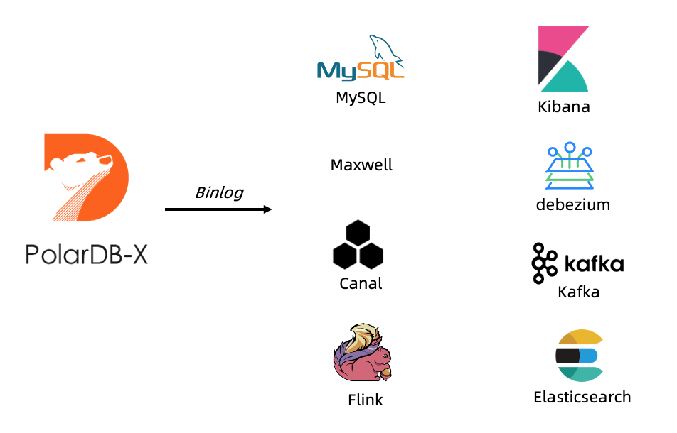

# PolarDB-X CDC data subscription

PolarDB-X CDC is compatible with the standard Binlog protocol, and can be used as a stand-alone version of MySQL. It now supports mainstream message queues, stream computing engines, and log service subscriptions such as Kafka and Flink.

### Supported downstream subscription types

- database:
- MySQL
- PolarDB-X
- Other databases that support the MySQL protocol
- Subscription component:
- Canal
- Debezius
- MaxWell
- Flow computing engine:
- Considerable
- message queue:
- rocketMQ
- rabbitMQ
- Kafka
- Log service:
- Elasticsearch
- Kibana