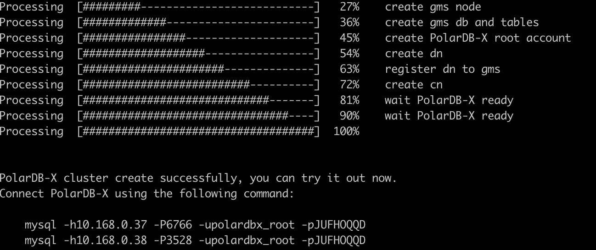
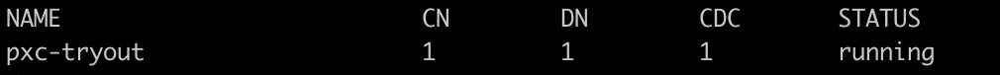

# Deploy the cluster via PXD

PXD is a deployment tool for PolarDB-X. In addition to supporting the local one-click quick launch of the test environment, it also supports deploying the PolarDB-X distributed database in a Linux cluster through a specified topology.

## System Configuration

1. Install Docker on all machines in the cluster, refer to the documentation: [https://docs.docker.com/engine/install/](https://docs.docker.com/engine/install/)
> Note: In cluster mode, the docker engine version needs to be greater than or equal to 18.04.
> Execute the `docker ps` command to verify after the installation is complete. If you encounter the following error, please refer to this section FAQ: How to obtain docker permissions for non-root users.
```text
Got permission denied while trying to connect to the Docker daemon socket at unix:///var/run/docker.sock: Get http:///var/run/docker.sock/v1.26/images/json: dial unix /var/run/docker.sock: connect: permission denied
```

2. Create and configure password-free login for cluster machines
> If you have configured SSH password-free login on your cluster machine, you can skip it

```shell
# generate key pair
ssh-keygen -t rsa

# Copy the free login public key to the target machine, modify user and ip
ssh-copy-id {user}@{ip}
```
## Install PXD on the deployment machine
Select any machine as the deployment machine, and install PXD on this machine. PXD will create a PolarDB-X database in the cluster through the deployment machine.

### Preparation

1. Install Python3

> If python3 is already installed on your machine, you can skip
>
> Check the command: `which python3`, if there is a return, it means that python3 is installed

Red Hat, CentOS or Fedora:

```shell
yum update -y
yum install -y python3
```
Debian or Ubuntu:

```shell
apt-get update
apt-get install python3.7
```

2. Create a Python3 virtual environment environment and activate it

```shell
python3 -m venv venv
source venv/bin/activate
```
> It is recommended to use virtual environment to install PXD tools


### Install PXD
Before installation, it is recommended to execute the following command to upgrade pip

```shell
pip install --upgrade pip
```
Execute the following command to install pxd:

```shell
pip install pxd
```
> Note: Some domestic users download the package from pypi slowly, you can use the following command to install from the image of Alibaba Cloud:
> `pip install -i http://mirrors.aliyun.com/pypi/simple/ pxd`

## Prepare PolarDB-X topology file
Write the following YAML file, specify the name of the PolarDB-X cluster and the deployment node of GMS, CN, and DN.

For example: a total of 3 machines 10.168.0.37, 10.168.0.38, 10.168.0.39 are prepared
1. 10.168.0.37, deploy gms, cdc nodes
2. 10.168.0.38, 10.168.0.39, deploy cn/dn two nodes each. Among them, the host_group under dn indicates a deployment machine with multiple copies of dn nodes. For example, if there are three copies of Paxos, three ips need to be filled in

```yaml
version: v1
type: polardbx
cluster:
name: pxc_test
gms:
image: polardbx/galaxyengine:latest
host_group: [10.168.0.37]
cn:
image: polardbx/galaxysql:latest
replica: 2
nodes:
- host: 10.168.0.38
- host: 10.168.0.39
resources:
mem_limit: 4G
dn:
image: polardbx/galaxyengine:latest
replica: 2
nodes:
- host_group: [10.168.0.38]
- host_group: [10.168.0.39]
resources:
mem_limit: 4G
cdc:
image: polardbx/galaxycdc:latest
replica: 1
nodes:
- host: 10.168.0.37
resources:
mem_limit: 4G
```

A PolarDB-X cluster created from the above topology file. The topology file includes the following properties:

- version: topology file version, no need to modify
- type: polardbx, no need to modify
- cluster.name: PolarDB-X cluster name
- cluster.gms.image: gms docker image name, optional. The default is the latest mirror
- cluster.gms.host_group: gms machine ip list, if you want to create a single copy mode, fill in 1 ip in the list, if you want to create a three-copy cluster based on Paxos, fill in 3 ip in the list. The Leader node of the three-copy cluster will be randomly selected from the first two IP nodes
- cluster.cn
- image: Compute node image name, optional, the default is the latest image
- replica: Calculate the number of nodes, which needs to correspond to the number of hosts in nodes
- nodes: ip list of computing nodes
- resources: resources used by computing nodes
- mem_limit: memory limit, default 2G
- cluster.dn
- image: The name of the data node image, which can be left blank and defaults to the latest image
- replica: the number of data nodes, which needs to correspond to the number of host_group in nodes
- nodes: host_group list of storage nodes, a host_group represents a deployment machine with multiple copies of a dn node, for example, if there are three copies of Paxos, three ips need to be filled in. The Leader node of the three-copy cluster will be randomly selected from the first two IP nodes
- resources: resources used by storage nodes
- mem_limit: memory limit, default 2G
- cluster.cdc
- image: CDC node image name, optional, the default is the latest image
- replica: the number of CDC nodes, which needs to correspond to the number of hosts in nodes
- nodes: CDC node ip list
- resources: resources used by CDC nodes
- mem_limit: memory limit, default 2G

> **Note**: If you create a Paxos-based three-copy cluster, you need PXD version 0.3.0 and above.

## Create a PolarDB-X cluster
Execute the following command to deploy PolarDB-X in the cluster with one click:

```shell
pxd create -file polardbx.yaml
```
After the deployment is complete, pxd will output the connection method of the PolarDB-X cluster, and you can log in to the PolarDB-X database for testing through the MySQL command line.



> Note:
> - The password of the PolarDB-X administrator account is randomly generated, it only appears this time, please save it.
> - PolarDB-X CN itself is stateless, and multiple CN nodes will be deployed in a cluster environment, and any CN can log in and execute SQL. If load balancing is required, a unified access address can be provided externally through load balancing components (such as LVS, HAProxy, or F5, etc.).


You can connect through the MySQL Client, and execute the following SQL to experience the distributed features of PolarDB-X initially. For details about PolarDB-X SQL, please refer to: [SQL Overview](https://help.aliyun.com/document_detail/313263.html)

```sql
# check GMS
select * from information_schema.schemata;

# create partition table
create database polarx_example partition_mode='partitioning';

use polarx_example;

create table example (
`id` bigint(11) auto_increment NOT NULL,
`name` varchar(255) DEFAULT NULL,
`score` bigint(11) DEFAULT NULL,
primary key (`id`)
) engine=InnoDB default charset=utf8
partition by hash(id)
partitions 8;

insert into example values(null,'lily',375),(null,'lisa',400),(null,'ljh',500);

select * from example;

show topology from example;

# check CDC
show master status ;
show binlog events in 'binlog.000001' from 4;


# Check DN and CN
show storage ;
show mpp ;
```

## View PolarDB-X cluster status
Execute the following command to view the PolarDB-X cluster status:

```shell
pxd list
```


Execute the following command to view more instructions and usage of pxd:
```shell
pxd --help
```
