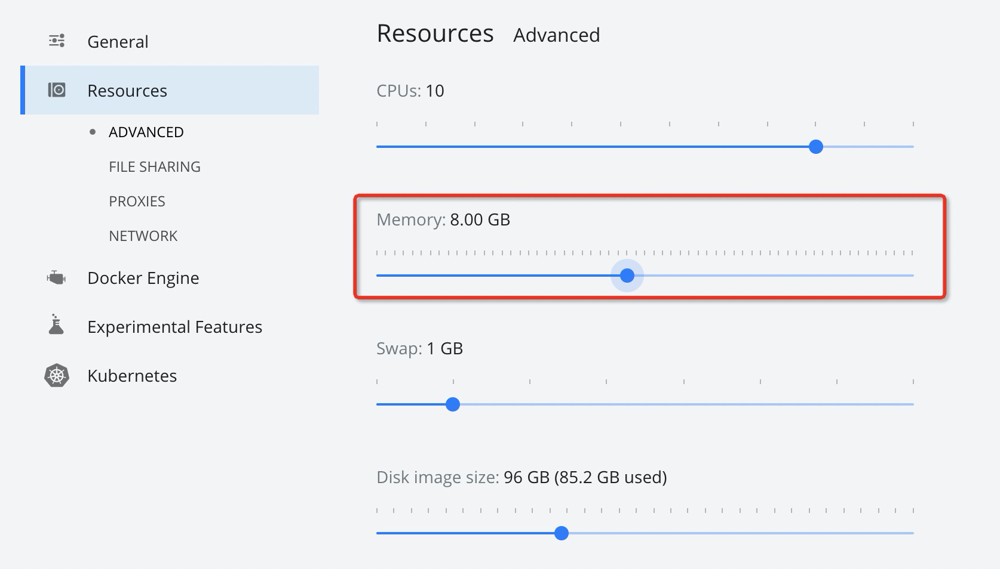
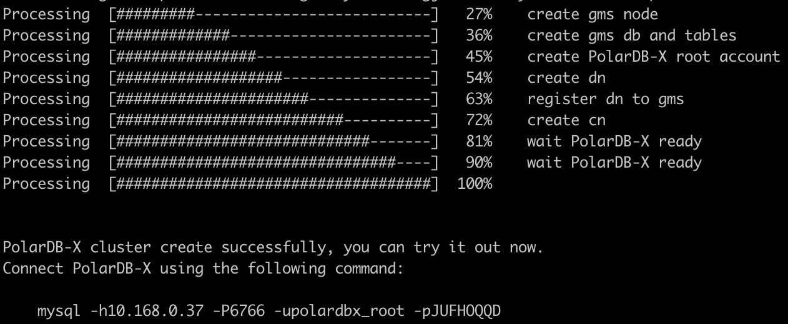

# Deploy a local instance via PXD

This article describes how to quickly get started with the PolarDB-X database. To get started with the PolarDB-X database, you will use the PXD tool. With PXD, you only need to execute a single command to quickly pull up a PolarDB-X locally.
> Note:
> - PXD is mainly for development and testing scenarios, please use [GalaxyKube](https://github.com/ApsaraDB/galaxykube) to deploy on K8S for production environment

## Preparation
Deploying the PolarDB-X database through the PXD tool requires installing Python3 and Docker first. The installation methods for different operating systems are given below:
> Note: PXD currently only supports x86 architecture machines

### Prepare test environment on macOS

> Note: MacBooks with M1 processors are not currently supported

1. Install Python3

> If python3 is already installed on your machine, you can skip
>
> Check the command: `which python3`, if there is a return, it means that python3 has been installed
>
> It is recommended to use Homebrew to install python3. If you do not have Homebrew, you can refer to the official Homebrew installation method:
```shell
/bin/bash -c "$(curl -fsSL https://raw.githubusercontent.com/Homebrew/install/master/install.sh)"
```

```shell
brew install python
```

2. Install Docker Desktop for Mac, refer to the documentation: [https://docs.docker.com/desktop/mac/install/](https://docs.docker.com/desktop/mac/install/)

> Since the default memory of Docker Desktop for Mac is 2G, it cannot meet the minimum requirements of the PolarDB-X development and testing environment,
> You need to adjust the memory to 8G in Docker Preferences, as shown in the figure below:



### Prepare Test Environment on CentOS

>Note: Including [Anolis OS](https://openanolis.cn/)

1. Install Python3

> If python3 is already installed on your machine, you can skip
>
> Check the command: `which python3`, if there is a return, it means that python3 has been installed

```shell
yum update -y
yum install -y python3
```

2. Install Docker, see the documentation for details: [https://docs.docker.com/engine/install/centos/](https://docs.docker.com/engine/install/centos/)

> Execute the `docker ps` command to verify after the installation is complete. If you encounter the following errors, please refer to the FAQ in this section: How to obtain docker permissions for non-root users
```text
Got permission denied while trying to connect to the Docker daemon socket at unix:///var/run/docker.sock: Get http:///var/run/docker.sock/v1.26/images/json: dial unix /var/run/docker.sock: connect: permission denied
```

### Prepare test environment on Ubuntu

1. Install Python3

> You can execute `python3` in the shell to check whether Python3 has been installed. If it is installed, go to step 2 directly.

```
apt-get update
apt-get install python3.8 python3.8-venv
```

2. Install Docker, see the documentation for details: [https://docs.docker.com/engine/install/ubuntu/](https://docs.docker.com/engine/install/ubuntu/)

> Execute the `docker ps` command to verify after the installation is complete. If you encounter the following errors, please refer to the FAQ in this section: How to obtain docker permissions for non-root users
```text
Got permission denied while trying to connect to the Docker daemon socket at unix:///var/run/docker.sock: Get http:///var/run/docker.sock/v1.26/images/json: dial unix /var/run/docker.sock: connect: permission denied
```

### Prepare test environment on Windows

Generally, WSL is used to run PolarDB-X on Windows platform.

1. Install WSL, refer to the document: [https://docs.microsoft.com/en-us/windows/wsl/install](https://docs.microsoft.com/en-us/windows/wsl/install) , using the default Linux distribution Ubuntu

2. Install Docker Desktop, refer to the documentation: [https://docs.docker.com/desktop/windows/wsl/](https://docs.docker.com/desktop/windows/wsl/)

3. Install Python3

> If python3 is already installed on your machine, you can skip

```shell
apt-get install python3
apt-get install python3-venv
```

4. Install pip

```shell
apt-get install python3-pip
```

## Install PXD
> Note: It is recommended to use virtual environment to install PXD tools
```shell
python3 -m venv venv
source venv/bin/activate
```

Before installation, it is recommended to execute the following command to upgrade pip
```shell
pip install --upgrade pip
```

Execute the following command to install pxd:
```shell
pip install pxd
```
> Note: Some domestic users download the package from pypi slowly, you can use the following command to install from the image of Alibaba Cloud:
```shell
pip install -i https://mirrors.aliyun.com/pypi/simple/ pxd
```


## Deploy PolarDB-X

- Running the pxd tryout command directly will create a PolarDB-X database of the latest version, including one GMS, CN, DN, and CDC nodes:
```shell
pxd tryout
```

- You can also specify CN, DN, the number and version of CDC nodes, the command is as follows:
```shell
pxd tryout -cn_replica 1 -cn_version latest -dn_replica 1 -dn_version latest -cdc_replica 1 -cdc_version latest
```

- The GMS and DN created in tryout mode adopt single-copy mode by default. If you want to create a three-copy cluster based on Paxos, use the following command:

```bash
pxd tryout -leader_only false
```

> **Note**: The three-copy mode requires PXD version 0.3.0 and above.

After the PolarDB-X database is created, the corresponding connection information will be output:



> Note: The password of the PolarDB-X administrator account is randomly generated, it only appears this time, please save it.

You can connect through the MySQL Client, and execute the following SQL to experience the distributed features of PolarDB-X initially. For details about PolarDB-X SQL, please refer to: [SQL Overview](../../dev-guide/topics/sql-overview.md)

```sql
# check GMS
select * from information_schema.schemata;

# create partition table
create database polarx_example partition_mode='partitioning';

use polarx_example;

create table example (
`id` bigint(11) auto_increment NOT NULL,
`name` varchar(255) DEFAULT NULL,
`score` bigint(11) DEFAULT NULL,
primary key (`id`)
) engine=InnoDB default charset=utf8
partition by hash(id)
partitions 8;

insert into example values(null,'lily',375),(null,'lisa',400),(null,'ljh',500);

select * from example;

show topology from example;

# check CDC
show master status ;
show binlog events in 'binlog.000001' from 4;


# Check DN and CN
show storage ;
show mpp ;
```

## View PolarDB-X status
Execute the following command to view the list of PolarDB-X in the current environment:
```shell
pxd list
```

## Clean PolarDB-X
Execute the following command to clean up all PolarDB-X in the local environment:
```shell
pxd cleanup
```

## Cluster deployment
In addition to supporting local one-click instance creation, PXD also supports deploying PolarDB-X in Linux clusters, please refer to: [Use PXD to deploy PolarDB-X in clusters](quickstart-pxd-cluster.md).

## FAQ

### How non-root users get docker permissions

1. Create a docker user group. In fact, when docker is installed, it will automatically create a user group named docker. You can check /etc/group to confirm the existence of the docker user group. If it does not exist, manually create a docker user group

```shell
sudo groupadd docker
```

2. Add the current non-root user to the docker user group

```shell
sudo gpasswd -a ${USER} docker
```
3. Switch the group of the current non-root user to the docker user group or log out and log in again

```shell
newgrp docker
```

4. Execute `docker ps` verification


### PolarDB-X Port Occupancy Instructions
In the current local test mode, CN, DN, and GMS nodes each occupy a port, which is randomly generated. If PolarDB-X fails to be created due to port conflicts, please execute `pxd cleanup` or `pxd delete {cluster name}` after cleaning Just recreate it.
