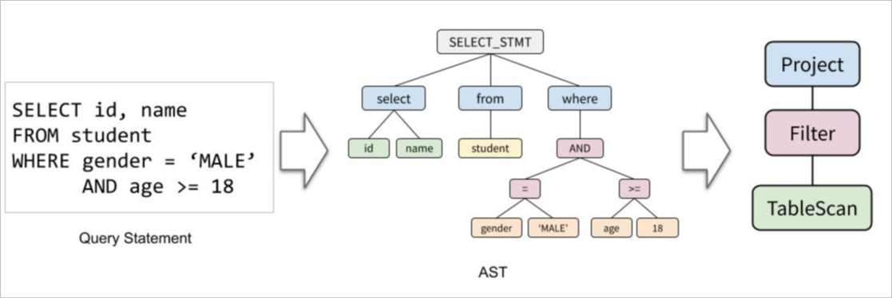
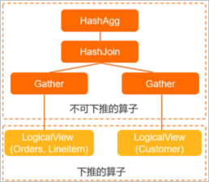

Introduction to Query Optimizer
============================

The query optimizer outputs a physical plan by optimizing the logical plan, and its main stages include query rewriting and plan enumeration. This article will introduce the basic principles of the query optimizer, including relational algebra operators, query rewriting (RBO stage), and query plan enumeration (CBO stage).

The execution process of PolarDB-X after receiving a SQL is roughly as follows:


* The syntax parser (Parser) parses the SQL text into an abstract syntax tree (AST).

* The syntax tree is converted into a logical plan based on relational algebra.

* The optimizer (Optimizer) optimizes the logical plan to obtain the physical plan.

* The executor (Executor) executes the plan, gets the query result and returns it to the client.


relational algebra operator
---------------------------



A SQL query is usually expressed as a tree composed of relational algebra operators in a database system, and there are operators in the following scenarios:


* Project: Used to describe SELECT columns in SQL, including function calculations.

* Filter: used to describe the WHERE condition in SQL.

* JOIN: Used to describe JOIN in SQL, and its corresponding physical operators include HashJoin, BKAJoin, Nested-Loop Join, SortMergeJoin, etc.

* Agg: Used to describe the Group By and aggregation functions in SQL, and the corresponding physical operators include HashAgg and SortAgg.

* Sort: Used to describe Order By and Limit in SQL, and its corresponding physical operators include TopN and MemSort.

* other


For example, for query SQL like:

```sql
SELECT l_orderkey, sum(l_extendedprice *(1 - l_discount)) AS revenue
FROM CUSTOMER, ORDERS, LINEITEM
WHERE c_mktsegment = 'AUTOMOBILE'
and c_custkey = o_custkey
and l_orderkey = o_orderkey
and o_orderdate < '1995-03-13'
and l_shipdate > '1995-03-13'
GROUP BY l_orderkey;
```


Use the following EXPLAIN command to see the execution plan of PolarDB-X:

```sql
HashAgg(group="l_orderkey", revenue="SUM(*)")
HashJoin(condition="o_custkey = c_custkey", type="inner")
Gather(concurrent=true)
LogicalView(tables="ORDERS_[0-7],LINEITEM_[0-7]", shardCount=8, sql="SELECT `ORDERS`.`o_custkey`, `LINEITEM`.`l_orderkey`, (`LINEITEM`.`l_extendedprice` * (? - `LINEITEM`.`l_discount`)) AS `x` FROM `ORDERS` AS `ORDERS` INNER JOIN `LINEITEM` AS `LINEITEM` ON (((`ORDERS`.`o_orderkey` = `LINEITEM`.`l_orderkey`) AND (`ORDERS`.`o_orderdate` < ?)) AND (`LINEITEM`.`l_shipdate` > ?))")
Gather(concurrent=true)
LogicalView(tables="CUSTOMER_[0-7]", shardCount=8, sql="SELECT `c_custkey` FROM `CUSTOMER` AS `CUSTOMER` WHERE (`c_mktsegment` = ?)")
```


It is represented by a tree diagram as follows:



**Description** The LogicalView on the left actually contains the JOIN of the ORDERS and LINEITEM tables. This is also reflected in the SQL properties of the LogicalView in the EXPLAIN results.

Query Rewriting (RBO)
------------------------------

The input of the query rewriting (SQL Rewrite) phase is a logical execution plan, and the output is a logical execution plan. This step mainly applies some heuristic rules, which is a rule-based optimizer (Rule-Based Optimizer, RBO for short), so it is often called the RBO stage.

The main functions of the query rewriting step are as follows:

* Subquery Unnesting

Subquery de-association is to express the subquery (associated subquery) containing related items as a SemiJoin or similar operator, which is convenient for various subsequent optimizations, such as pushing down to the storage layer MySQL or selecting a certain type in the PolarDB-X layer. Algorithm execution. In the following example, the IN subquery is converted into a SemiJoin operator, and finally converted into a SemiHashJoin physical operator to be executed by PolarDB-X:

```sql
> explain  select id from t1 where id in (select id from t2 where t2.name = 'hello');
SemiHashJoin(condition="id = id", type="semi")
Gather(concurrent=true)
LogicalView(tables="t1", shardCount=2, sql="SELECT `id` FROM `t1` AS `t1`")
Gather(concurrent=true)
LogicalView(tables="t2_[0-3]", shardCount=4, sql="SELECT `id` FROM `t2` AS `t2` WHERE (`name` = ?)")
```


* operator push down

Pushing down operators is a very critical step. PolarDB-X has built-in optimization rules for pushing down operators as follows:


| Optimization Rule | Description |
|-----------------|-------------------------------------------------------------|
| Predicate pushdown or column pruning | Push down the Filter and Project operators to the MySQL storage layer for execution, and filter out unnecessary rows and columns. |
| JOIN Clustering | Rearrange and cluster the JOIN according to the split method and the equivalent condition of the split key, so as to facilitate the push-down of the JOIN in the next step. |
| JOIN pushdown | For qualified JOINs, push them down to the storage layer MySQL for execution. |
| Agg Pushdown | Split the aggregation (Agg) into FinalAgg and LocalAgg, and push LocalAgg down to the storage layer MySQL. |
| Sort Pushdown | Split sorting (Sort) into two stages, MergeSort and LocalSort, and push down LocalSort to the storage layer MySQL. |


For more information about query pushdown, see [Query Rewriting and Pushdown](query-rewriting.md).


Query Plan Enumeration (CBO)
--------------------------------

The logical execution plan output by the query rewriting phase will be input into the query plan enumeration (Plan Enumerator), and a final physical execution plan will be output. Query plan enumeration Among multiple feasible query plans, select the one with the lowest cost according to the predefined cost model. Different from the query rewriting stage, in the query plan enumeration, the rules may generate better execution plans or worse execution plans, and the better one can be selected according to the cost comparison before and after the operator is optimized by the rules. So this is also called Cost-based Optimizer (CBO for short).

Its core components have the following parts:

* Statistics

* Cardinality Estimation

* Transform Rules (Transform Rules)

* Cost Model (Cost Model)

* Plan Space Search Engine


Logically, the CBO process consists of the following steps:

1. The search engine uses conversion rules to transform the input logical execution plan to construct a search space for the physical execution plan.

2. Use the cost model to estimate the cost of each execution plan in the search space, and select the physical execution plan with the lowest cost.

3. The process of cost estimation is inseparable from cardinality estimation. It uses the statistical information of each table and column to estimate the number of input rows and selectivity of each operator, and provides it to the cost model of the operator to estimate the query plan. the price.


