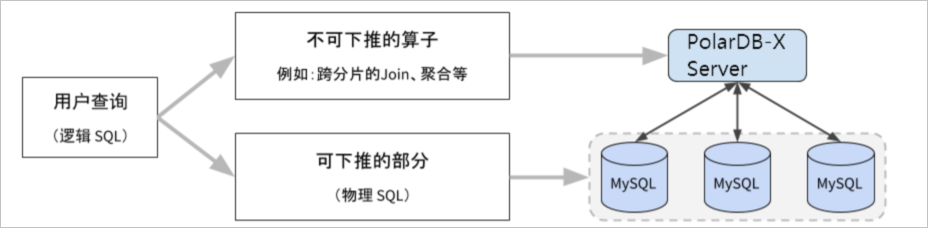

Tuning Basic Concepts
===========================

Distributed databases are different from stand-alone database architectures, so distributed databases have their own tuning methods in terms of stand-alone database tuning experience. In the process of using PolarDB-X, we will find out the cause of slow SQL execution based on statistical information, execution plan and concurrency strategy, and the running time feedback after execution, and perform targeted tuning.

basic structure
-------------------------

PolarDB-X is a distributed database product that separates computing and storage. When a query SQL (called logical SQL) is sent to the PolarDB-X computing node (CN), PolarDB-X will divide it into two parts that can be pushed down and those that cannot be pushed down. The part that can be pushed down is also called for physical SQL. SQL that cannot be pushed down is executed on the CN, and SQL that is pushed down is executed on the DN.

In principle, PolarDB-X performs execution optimization according to the following rules as much as possible during the query optimization process:

* Push down user SQL to DN for execution as much as possible. In addition to avoiding data network interaction between CN and DN, it can also make full use of the ability of multi-shard concurrent execution, and use each DN resource to speed up query.

* For some operators that cannot be pushed down, the optimizer will choose the optimal way to execute, such as selecting the appropriate operator for execution, selecting the appropriate parallelism strategy, and whether to use MPP for execution.

In addition to this, the selection of the best index possible is considered during the optimization process.

basic concept
-------------------------

In the process of SQL tuning, we also need to understand the following concepts:

* Logical SQL: query SQL initiated by the user side;

* Physical SQL: After query optimization, SQL is generally split into SQL that can be pushed down and SQL that cannot be pushed down. Among them, the SQL that can be pushed down is sent to the DN for execution, which is called physical SQL. If all logical SQL is pushed down to DN for execution, physical SQL is equivalent to logical SQL.

* Parallelism: refers to the maximum number of parallel data executions during the query process. For CN, it is multi-threaded computing using multi-core capabilities. For DN, it is the number of parallel executions of multiple push-down physical SQLs at the same time.

* Execution plan: Logical SQL is sent to the CN node, and an executable plan tree will be generated after parsing and optimization. Each node of the plan tree represents an operator. Generally, the execution plan can be used to preliminarily determine the speed of the query, such as whether the index is hit, whether the operator selection is appropriate, and so on.

* Index: PolarDB-X is generally divided into local index and global index. Local index refers to the index of a single DN node (MYSQL index), and global index refers to a distributed index built on multiple DNs. Choosing an appropriate index can greatly improve the retrieval speed of PolarDB-X.

A slow query may be related to the speed of physical SQL execution, the amount of concurrency, execution plan and index selection. Therefore, in a distributed database, the cost of SQL tuning is generally higher than that of a stand-alone database.

