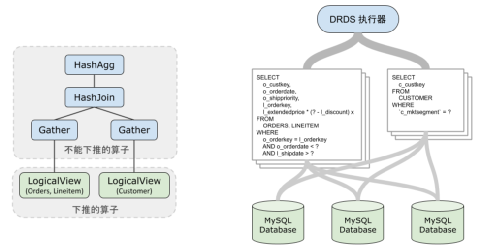
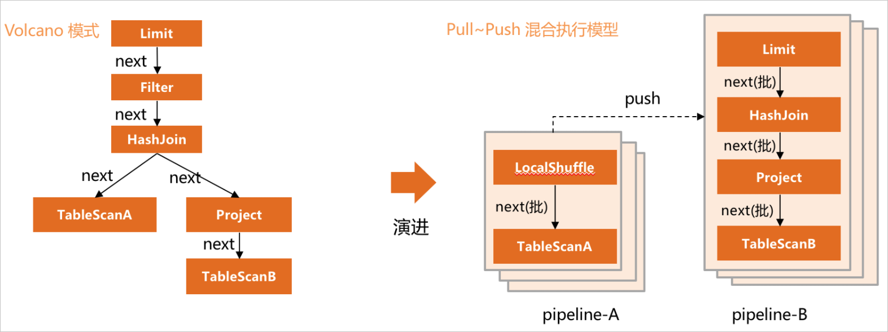

Introduction to query executors
============================

This article describes how PolarDB-X's SQL executor executes parts of SQL that cannot be pushed down.

basic concept
-------------------------

The SQL executor is a component that executes logical layer operators in PolarDB-X. For simple query SQL, MySQL execution can often be pushed down to the storage layer as a whole, so the existence of the executor is not felt, and the MySQL result is simply unpacked and sent back to the user. However, for more complex SQL, it is often impossible to push down all the operators in SQL. At this time, the PolarDB-X executor is required to perform calculations that cannot be pushed down.

```sql
SELECT l_orderkey, sum(l_extendedprice *(1 - l_discount)) AS revenue
FROM CUSTOMER, ORDERS, LINEITEM
WHERE c_mktsegment = 'AUTOMOBILE'
and c_custkey = o_custkey
and l_orderkey = o_orderkey
and o_orderdate < '1995-03-13'
and l_shipdate > '1995-03-13'
GROUP BY l_orderkey;
```

The execution plan of PolarDB-X seen through the EXPLAIN command is as follows:

```sql
HashAgg(group="l_orderkey", revenue="SUM(*)")
HashJoin(condition="o_custkey = c_custkey", type="inner")
Gather(concurrent=true)
LogicalView(tables="ORDERS_[0-7],LINEITEM_[0-7]", shardCount=8, sql="SELECT `ORDERS`.`o_custkey`, `LINEITEM`.`l_orderkey`, (`LINEITEM`.`l_extendedprice` * (? - `LINEITEM`.`l_discount`)) AS `x` FROM `ORDERS` AS `ORDERS` INNER JOIN `LINEITEM` AS `LINEITEM` ON (((`ORDERS`.`o_orderkey` = `LINEITEM`.`l_orderkey`) AND (`ORDERS`.`o_orderdate` < ?)) AND (`LINEITEM`.`l_shipdate` > ?))")
Gather(concurrent=true)
LogicalView(tables="CUSTOMER_[0-7]", shardCount=8, sql="SELECT `c_custkey` FROM `CUSTOMER` AS `CUSTOMER` WHERE (`c_mktsegment` = ?)")
```


As shown in the figure below, LogicalView SQL is sent to MySQL during execution, and the parts that cannot be pushed down (operators other than LogicalView) are calculated by the PolarDB-X executor to obtain the results required by the end user SQL.



execution model
-------------------------

Unlike traditional databases that use the Volcano execution model, PolarDB-X samples a Pull\~Push hybrid execution model. All operators divide the execution process into multiple pipelines according to whether they need to cache temporary tables during the calculation process. The next() interface is sampled inside the pipeline, and the data is obtained in batches to complete the calculation inside the pipeline. The push interface is used between pipelines, and the upstream pipeline After the calculation is completed, the data will be continuously pushed to the downstream pipeline for calculation. In the following example, it is divided into two pipelines, and Table-A data is scanned in pipeline-A to complete the construction of the hash table. Pipeline-B scans the data of Table-B, and then associates within the HashJoin operator to obtain the JOIN result, and then returns it to the client.



execution mode
-------------------------

Currently PolarDB-X supports three execution modes:

* Stand-alone single-thread (TP_LOCAL): In the query process, it is a single-threaded calculation. The number of scanned rows involved in the query of TP load is relatively small, and this execution mode is often used, such as the enumeration based on the primary key.

* Stand-alone parallel (AP_LOCAL): During the query process, the multi-core resources of the node will be used for parallel computing. If you do not configure a read-only instance, the query for AP load will often sample this execution mode, which is generally called Parallel Query model.

* Multi-machine Parallel (MPP) (WIP): If you configure a read-only instance, you can coordinate the multi-core of multiple nodes on the read-only instance to perform distributed multi-machine parallel acceleration for the query of AP load.


In order to accurately know the execution mode, [EXPLAIN PHYSICAL](../../dev-guide/topics/explain.md) is extended on the basis of the original EXPLAIN and execution plan. For example, the following query can view the current query sample through the command The MPP mode is used, and the number of concurrency of each execution segment can also be obtained.

```sql
mysql> explain physical select a.k, count(*) cnt from sbtest1 a, sbtest1 b where a.id = b.k and a.id > 1000 group by k having cnt > 1300 or
der by cnt limit 5, 10;
+-------------------------------------------------------------------------------------------------------------------------------------------------------------------+
| PLAN                                                                                                                                                              |
+-------------------------------------------------------------------------------------------------------------------------------------------------------------------+
| ExecutorType: MPP                                                                                                                                                 |
| The Query's MaxConcurrentParallelism: 2                                                                                                                           |
| Fragment 1                                                                                                                                                        |
|     Shuffle Output layout: [BIGINT, BIGINT] Output layout: [BIGINT, BIGINT]                                                                                       |
|     Output partitioning: SINGLE [] Parallelism: 1                                                                                                                 |
|     TopN(sort="cnt ASC", offset=?2, fetch=?3)                                                                                                                     |
|   Filter(condition="cnt > ?1")                                                                                                                                    |
|     HashAgg(group="k", cnt="COUNT()")                                                                                                                             |
|       BKAJoin(condition="k = id", type="inner")                                                                                                                   |
|         RemoteSource(sourceFragmentIds=[0], type=RecordType(INTEGER_UNSIGNED id, INTEGER_UNSIGNED k))                                                             |
|         Gather(concurrent=true)                                                                                                                                   |
|           LogicalView(tables="[000000-000003].sbtest1_[00-15]", shardCount=16, sql="SELECT `k` FROM `sbtest1` AS `sbtest1` WHERE ((`k` > ?) AND (`k` IN (...)))") |
| Fragment 0                                                                                                                                                        |
|     Shuffle Output layout: [BIGINT, BIGINT] Output layout: [BIGINT, BIGINT]                                                                                       |
|     Output partitioning: SINGLE [] Parallelism: 1 Splits: 16                                                                                                      |
|     LogicalView(tables="[000000-000003].sbtest1_[00-15]", shardCount=16, sql="SELECT `id`, `k` FROM `sbtest1` AS `sbtest1` WHERE (`id` > ?)")                     |
+-------------------------------------------------------------------------------------------------------------------------------------------------------------------+
```


It also allows you to specify the execution mode via `HINT EXECUTOR_MODE`. For example, the main instance has a lot of idle resources, and you can consider forcing it to be a single-machine or multi-machine parallel mode to speed up.

```sql
mysql> explain physical /*+TDDL:EXECUTOR_MODE=AP_LOCAL*/select a.k, count(*) cnt from sbtest1 a, sbtest1 b where a.id = b.k and a.id > 1000 group by k having cnt > 1300 order by cnt limit 5, 10;                                                                                                                                                     |
+-------------------------------------------------------------------------------------------------------------------------------------------------------------+
| ExecutorMode: AP_LOCAL                                                                                                                                      |
| Fragment 0 dependency: [] parallelism: 4                                                                                                                    |
| BKAJoin(condition="k = id", type="inner")                                                                                                                   |
|   Gather(concurrent=true)                                                                                                                                   |
|     LogicalView(tables="[000000-000003].sbtest1_[00-15]", shardCount=16, sql="SELECT `id`, `k` FROM `sbtest1` AS `sbtest1` WHERE (`id` > ?)")               |
|   Gather(concurrent=true)                                                                                                                                   |
|     LogicalView(tables="[000000-000003].sbtest1_[00-15]", shardCount=16, sql="SELECT `k` FROM `sbtest1` AS `sbtest1` WHERE ((`k` > ?) AND (`k` IN (...)))") |
| Fragment 1 dependency: [] parallelism: 8                                                                                                                    |
| LocalBuffer                                                                                                                                                 |
|   RemoteSource(sourceFragmentIds=[0], type=RecordType(INTEGER_UNSIGNED id, INTEGER_UNSIGNED k, INTEGER_UNSIGNED k0))                                        |
| Fragment 2 dependency: [0, 1] parallelism: 8                                                                                                                |
| Filter(condition="cnt > ?1")                                                                                                                                |
|   HashAgg(group="k", cnt="COUNT()")                                                                                                                         |
|     RemoteSource(sourceFragmentIds=[1], type=RecordType(INTEGER_UNSIGNED id, INTEGER_UNSIGNED k, INTEGER_UNSIGNED k0))                                      |
| Fragment 3 dependency: [0, 1] parallelism: 1                                                                                                                |
| LocalBuffer                                                                                                                                                 |
|   RemoteSource(sourceFragmentIds=[2], type=RecordType(INTEGER_UNSIGNED k, BIGINT cnt))                                                                      |
| Fragment 4 dependency: [2, 3] parallelism: 1                                                                                                                |
| TopN(sort="cnt ASC", offset=?2, fetch=?3)                                                                                                                   |
|   RemoteSource(sourceFragmentIds=[3], type=RecordType(INTEGER_UNSIGNED k, BIGINT cnt))                                                                      |
+-------------------------------------------------------------------------------------------------------------------------------------------------------------+
```


The concurrency degree in the multi-machine parallel MPP execution mode is calculated based on the number of physical scan rows, instance specifications, and the number of table sub-tables involved in the calculation. The overall degree of parallelism should consider high concurrency scenarios, so the calculation of the degree of parallelism will On the conservative side, you can check the degree of parallelism with the `EXPLAIN PHYSICAL` command above. It also supports `HINT MPP_PARALLELISM` to enforce the parallelism.

```sql
/*+TDDL:EXECUTOR_MODE=MPP MPP_PARALLELISM=8*/select a.k, count(*) cnt from sbtest1 a, sbtest1 b where a.id = b.k and a.id > 1000 group by k having cnt > 1300 order by cnt limit 5, 10;
```


