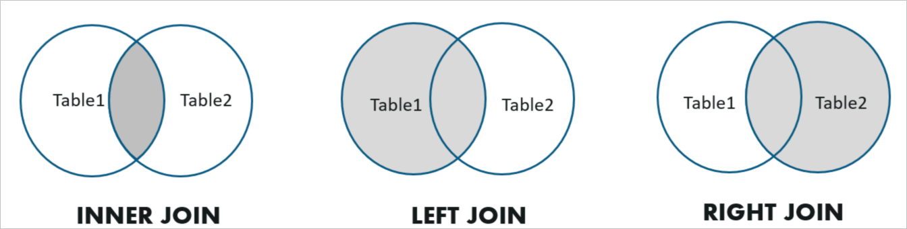
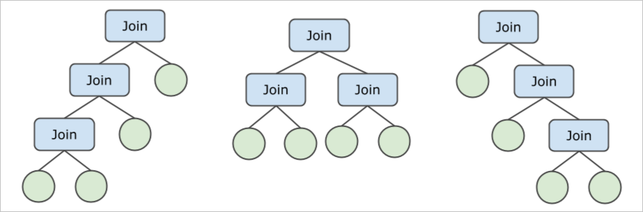

JOIN optimization and execution
==============================

This article mainly introduces how to use JOIN. JOIN is the process of retrieving associated data by connecting multiple tables with one or some columns as conditions, and multiple tables are associated with common columns.

basic concept
-------------------------

JOIN is a common operation in SQL queries. Logically speaking, its semantics are equivalent to performing a Cartesian product of two tables, and then retaining the data that meets the conditions according to the filter conditions. In most cases, JOIN is a JOIN that relies on equivalence conditions, that is, Equi-Join, which is used to connect the data of two tables according to the value of a specific column.

A subquery is a query block nested inside SQL, and the result of the subquery is used as input to fill in the outer query to calculate the result of the outer query. Subqueries can appear in many places in the SQL statement, such as output data in the SELECT clause, a view as input in the FROM clause, and filter conditions in the WHERE clause.

This article discusses all JOIN operators that do not push down. If JOIN is pushed down to LogicalView, its execution method is selected by the storage layer MySQL.

JOIN type
---------------------------

PolarDB-X supports three common JOIN types: Inner Join, Left Outer Join, and Right Outer Join.



The following are examples of several different types of JOINs:

```sql
/* Inner Join */
SELECT * FROM A, B WHERE A.key = B.key;
/* Left Outer Join */
SELECT * FROM A LEFT JOIN B ON A.key = B.key;
/* Right Outer Join */
SELECT * FROM A RIGHT OUTER JOIN B ON A.key = B.key;
```

Semi-Join and Anti-Join are also supported. Semi Join and Anti Join cannot be directly expressed in SQL statements, and are usually converted by EXISTS or IN subqueries containing associated items. The following are examples of Semi-Join and Anti-Join.

```sql
/* Semi Join - 1 */
SELECT * FROM Emp WHERE Emp.DeptName IN (
SELECT DeptName FROM Dept
)
/* Semi Join - 2 */
SELECT * FROM Emp WHERE EXISTS (
SELECT * FROM Dept WHERE Emp.DeptName = Dept.DeptName
)
/* Anti Join - 1 */
SELECT * FROM Emp WHERE Emp.DeptName NOT IN (
SELECT DeptName FROM Dept
)
/* Anti Join - 2 */
SELECT * FROM Emp WHERE NOT EXISTS (
SELECT * FROM Dept WHERE Emp.DeptName = Dept.DeptName
)
```


JOIN algorithm
---------------------------

Currently, PolarDB-X supports JOIN algorithms such as Nested-Loop Join, Hash Join, Sort-Merge Join, and Lookup Join (BKAJoin).

**Nested-Loop Join (NLJoin)**

Nested-Loop Join is usually used for unequal JOIN. It works like this:

1. Pull all the data from the inner table (the right table, usually the side with a smaller amount of data) and cache it in memory.

2. Traverse the table data, for each row of the table:
* For each piece of internal table data cached in memory.

* Construct the result row, check whether the JOIN condition is met, and output if the condition is met.


The following is an example of Nested-Loop Join:

```sql
> EXPLAIN SELECT * FROM partsupp, supplier WHERE ps_suppkey < s_suppkey;
NlJoin(condition="ps_suppkey < s_suppkey", type="inner")
Gather(concurrent=true)
LogicalView(tables="partsupp_[0-7]", shardCount=8, sql="SELECT * FROM `partsupp` AS `partsupp`")
Gather(concurrent=true)
LogicalView(tables="supplier_[0-7]", shardCount=8, sql="SELECT * FROM `supplier` AS `supplier`")
```


Generally speaking, Nested-Loop Join is the least efficient JOIN operation, and it is generally only used when the JOIN condition does not contain equivalent values ​​(such as the above example) or when the amount of data in the internal table is extremely small. PolarDB-X can be forced to use Nested-Loop Join and determine the JOIN sequence through the following Hint:

```sql
/*+TDDL:NL_JOIN(outer_table, inner_table)*/ SELECT ...
```

Among them, inner_table and outer_table can also be JOIN results of multiple tables, for example:

```sql
/*+TDDL:NL_JOIN((outer_table_a, outer_table_b), (inner_table_c, inner_table_d))*/ SELECT ...
```


**Hash Join**

Hash Join is one of the most commonly used algorithms for equivalent JOIN. Its principle is as follows:

* Pull all the data in the inner table (the right table, usually the side with a smaller amount of data) and write it into the hash table in memory.

* Traversing the table data, for each row of the table:
* Query the hash table according to the equivalent condition JOIN Key, and take out 0-N matching rows (the JOIN Key is the same).

* Construct the result row, check whether the JOIN condition is met, and output if the condition is met.


Hash Join example:

```sql
> EXPLAIN SELECT * FROM partsupp, supplier WHERE ps_suppkey = s_suppkey;
HashJoin(condition="ps_suppkey = s_suppkey", type="inner")
Gather(concurrent=true)
LogicalView(tables="partsupp_[0-7]", shardCount=8, sql="SELECT * FROM `partsupp` AS `partsupp`")
Gather(concurrent=true)
LogicalView(tables="supplier_[0-7]", shardCount=8, sql="SELECT * FROM `supplier` AS `supplier`")
```


Hash Join often occurs in complex queries with a large amount of JOIN data and cannot be improved by index Lookup. In this case, Hash Join is the best choice. For example, in the above example, both the partsupp table and the supplier table are full table scans, and the data volume is large, so it is suitable to use HashJoin. Since the inner table of Hash Join needs to be used to construct the hash table in memory, the data volume of the inner table is generally smaller than that of the outer table. Usually the optimizer can automatically select the optimal JOIN order. If you need manual control, you can also pass the Hint below.

PolarDB-X can be forced to use Hash Join and determine the order of JOIN through the following Hint:

```sql
/*+TDDL:HASH_JOIN(table_outer, table_inner)*/ SELECT ...
```


**Lookup Join (BKAJoin)**

Lookup Join is another commonly used equivalent JOIN algorithm, which is often used when the amount of data is small. It works as follows:

1. Traversing the outer table (left table, usually the side with a smaller amount of data) data, for each batch (for example, 1000 rows) of data in the outer table.

2. Combine the JOIN Key of this batch of data into an IN (...) condition, and add it to the query of the internal table.

3. Execute the internal table query to get the rows matching the JOIN.

4. With the help of the hash table, find the matching inner table row for each row of the outer table, combine and output.


Lookup Join (BKAJoin) example:

```sql
> EXPLAIN SELECT * FROM partsupp, supplier WHERE ps_suppkey = s_suppkey AND ps_partkey = 123;
BKAJoin(condition="ps_suppkey = s_suppkey", type="inner")
LogicalView(tables="partsupp_3", sql="SELECT * FROM `partsupp` AS `partsupp` WHERE (`ps_partkey` = ?)")
Gather(concurrent=true)
LogicalView(tables="supplier_[0-7]", shardCount=8, sql="SELECT * FROM `supplier` AS `supplier` WHERE (`s_suppkey` IN ('?'))")
```


Lookup Join is usually used when the amount of external data is small. For example, in the above example, the left table partsupp has only a few rows of data due to the filter condition of ps_partkey = 123. In addition, the s_suppkey IN ( ... ) query of the right table hits the primary key index, which further reduces the query cost of Lookup Join.

PolarDB-X can be forced to use LookupJoin and determine the order of JOIN through the following Hint:

```sql
/*+TDDL:BKA_JOIN(table_outer, table_inner)*/ SELECT ...
```


**Note** The inner table of Lookup Join can only be a single table, and cannot be the result of JOIN of multiple tables.

**Sort-Merge Join**

Sort-Merge Join is another equivalent JOIN algorithm, which depends on the order of the left and right inputs and must be sorted by the JOIN Key. It works as follows:

1. Before starting Sort-Merge Join, the input must be sorted (with MergeSort or MemSort).

2. Compare the current input rows of the left and right tables, and operate in the following way to continuously consume the input on the left and right sides:
* If the JOIN Key of the left table is smaller, consume the next piece of data in the left table.

* If the JOIN Key of the right table is smaller, consume the next piece of data in the right table.

* If the JOIN Keys of the left and right tables are equal, it means that one or more matches have been obtained, check whether the JOIN conditions are met and output.


Lookup Join (BKAJoin) example:

```sql
> EXPLAIN SELECT * FROM partsupp, supplier WHERE ps_suppkey = s_suppkey ORDER BY s_suppkey;
SortMergeJoin(condition="ps_suppkey = s_suppkey", type="inner")
MergeSort(sort="ps_suppkey ASC")
LogicalView(tables="QIMU_0000_GROUP,QIMU_0001_GROUP.partsupp_[0-7]", shardCount=8, sql="SELECT * FROM `partsupp` AS `partsupp` ORDER BY `ps_suppkey`")
MergeSort(sort="s_suppkey ASC")
LogicalView(tables="QIMU_0000_GROUP,QIMU_0001_GROUP.supplier_[0-7]", shardCount=8, sql="SELECT * FROM `supplier` AS `supplier` ORDER BY `s_suppkey`")
```


The MergeSort operator in the above execution plan and the pushed-down ORDER BY ensure that the inputs on both sides of the Sort-Merge Join are sorted by the JOIN Key, namely s_suppkey (ps_suppkey).

Sort-Merge Join is usually not optimal due to the additional sorting steps required. However, in some cases, client queries also need to be sorted by JOIN Key (the above example), and Sort-Merge Join is a better choice at this time.

PolarDB-X can be forced to use Sort-Merge Join through the following Hint

```sql
/*+TDDL:SORT_MERGE_JOIN(table_a, table_b)*/ SELECT ...
```


JOIN sequence
---------------------------

In the scenario of multi-table joins, a very important task of the optimizer is to determine the order of joins between tables, because different join orders will affect the size of the intermediate result set, which in turn will affect the execution cost of the overall plan.

For example, for the JOIN of 4 tables (not considering the case of pushdown), the JOIN Tree can have the following 3 forms, and at the same time, there are 4! = 24 kinds of table arrangements, and there are a total of 72 possible JOIN sequences.



Given a JOIN of N tables, PolarDB-X uses an adaptive strategy to generate the optimal JOIN plan:

* When N (not pushed down) is small, the Bushy enumeration strategy is adopted, and the optimal plan will be selected in all JOIN orders.

* When the number of tables (not pushed down) is large, adopt Zig-Zag (sawtooth) or Left-Deep (left deep tree) enumeration strategy to select the optimal Zig-Zag or Left-Deep execution plan , to reduce the number and cost of enumeration.


PolarDB-X uses a cost-based optimizer (CBO) to select the JOIN sequence with the lowest total cost. For details, see [Query Optimizer Introduction](cbo.md)

In addition, each JOIN algorithm also has different preferences for left and right inputs. For example, the right table in Hash Join is used as an inner table to build a hash table, so the smaller table should be placed on the right. These will also be considered in the CBO.

PolarDB-X supports the richer Join algorithms mentioned above, and the optimizer will choose a relatively reasonable Join algorithm based on statistical information. Here is a list of scenarios where each Join algorithm is more suitable


| JOIN Algorithm | Usage Scenarios |
|-----------------|------------------------------------------|
| NLJoin | Non-equivalent JOIN scenarios |
| HashJoin | Most equivalent Joins tend to choose HashJoin, unless the data is seriously skewed |
| BKAJoin | The amount of data in the external table is small, while the data in the internal table is relatively large |
| Sort-Merge-Join | Sort-Merge-Join is preferred when the data is severely skewed or the data input is already ordered |


