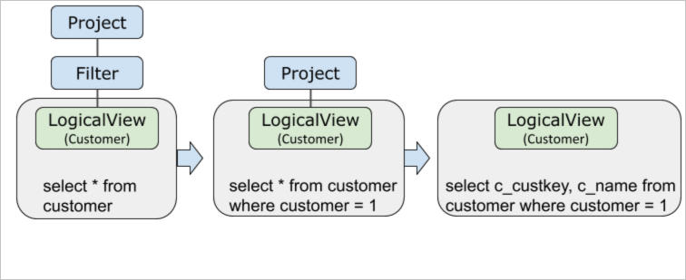
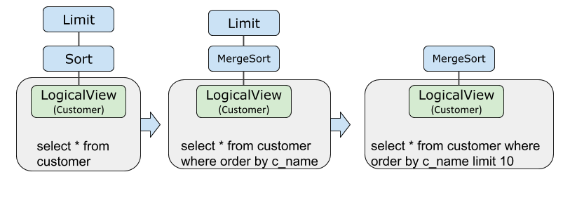
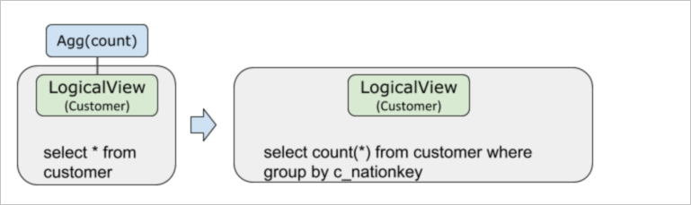
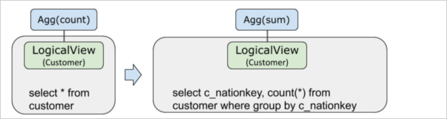
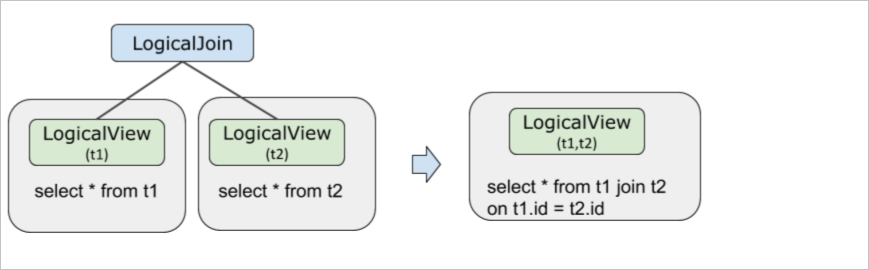
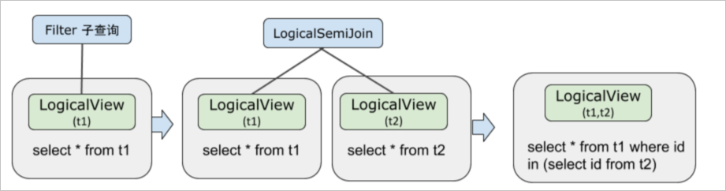

Query Rewrite and Pushdown
============================

Pushdown is an important optimization for query rewriting. The split information of PolarDB-X is used to optimize the execution plan, so that operators can be pushed down as much as possible to achieve the purpose of filtering data in advance, reducing network transmission, and parallel computing.

Background Information
-------------------------

According to the basic principles of SQL statement optimization in PolarDB-X, as many calculations as possible can be pushed down to the storage layer MySQL for execution. The push-down calculation mainly includes:

* JOIN connection

* Filter conditions (such as `WHERE` or `HAVING`)

* Computations (e.g. `COUNT`, `GROUP BY`)

* Sorting (like `ORDER BY`)

* Deduplication (eg `DISTINCT`)

* Function calculation (such as `NOW()` function)

* subquery


Through explain optimizer + sql, you can see the specific process of query rewriting.

Project and Filter push down
-------------------------------------

During the following generation process of an SQL execution plan, Filter and Project are pushed down to the LogicalView operator. Pushing down Filter and Project can filter data in advance and reduce network transmission.

```sql
mysql> explain optimizer select c_custkey,c_name from customer where c_custkey = 1;
```

where c_custkey is the partition key.



Limit and Sort pushdown
---------------------------------

During the following generation process of an SQL execution plan, Sort and Limit are pushed down to the LogicalView operator. The pushdown of Sort and Limit can achieve the effects of filtering data in advance, reducing network transmission, parallel execution, and reducing the memory usage of PolarDB-X.

```sql
mysql> explain optimizer select * from customer order by c_name limit 10
```



Agg push down
---------------------------------

During the following generation process of an SQL execution plan, Agg is pushed down to the LogicalView operator.

Agg pushdown can achieve the effects of filtering data in advance, reducing network transmission, parallel execution, and reducing the memory usage of PolarDB-X.

```sql
explain optimizer select count(*) from customer group by c_nationkey;
```

When the partition key is c_nationkey:



When the split key is not c_nationkey:



JOIN down
---------------------------

The pushdown of JOIN needs to meet the following conditions:

* The splitting methods of t1 and t2 tables are the same (including sub-database key, sub-table key, splitting function, number of sub-library and sub-tables).

* The JOIN condition includes the equivalence relationship of the t1 and t2 table split keys. Additionally, arbitrary table JOIN broadcast tables can always be pushed down.


```sql
mysql> explain optimizer select * from t1, t2 where t1.id = t2.id;
```


During the following generation process of an SQL execution plan, the JOIN is pushed down to the LogicalView operator. Pushing down JOIN can achieve the effect that computing is closer to storage and parallel execution is accelerated.



JoinClustering
-----------------------------------

When there are multiple tables performing JOIN operations, PolarDB-X will reorder the JOINs through the optimization technology of join clustering, and put the pushed-down JOINs in adjacent positions so that they can be pushed down normally. Examples are as follows:

Assuming that the original JOIN sequence is t2, t1, and l2, after reordering, the JOIN operations of t2 and l2 can still be pushed down to LogicalView. SQLCopy code

```sql
mysql> explain select t2.id from t2 join t1 on t2.id = t1.id join l2 on t1.id = l2.id;
Project(id="id")
HashJoin(condition="id = id AND id = id0", type="inner")
Gather(concurrent=true)
LogicalView(tables="t2_[0-3],l2_[0-3]", shardCount=4, sql="SELECT `t2`.`id`, `l2`.`id` AS `id0` FROM `t2` AS `t2` INNER JOIN `l2` AS `l2` ON (`t2`.`id` = `l2`.`id`) WHERE (`t2`.`id` = `l2`.`id`)")
Gather(concurrent=true)
LogicalView(tables="t1", shardCount=2, sql="SELECT `id` FROM `t1` AS `t1`")
```


subquery pushdown
--------------------------

During the following generation process of an SQL execution plan, the subquery is pushed down to the `LogicalView` operator. Subquery pushdown can achieve the effect that calculation is closer to storage and parallel execution is accelerated.

1. The subquery will be converted into `Semi Join` or `Anti Join` first

2. If the judgment conditions for JOIN pushdown in the previous section are satisfied, `Semi Join` or `Anti Join` will be pushed down to `LogicalView`

3. The pushed-down `Semi Join` or `Anti Join` will be restored as a subquery.


```sql
explain optimizer select * from t1 where id in (select id from t2);
```



