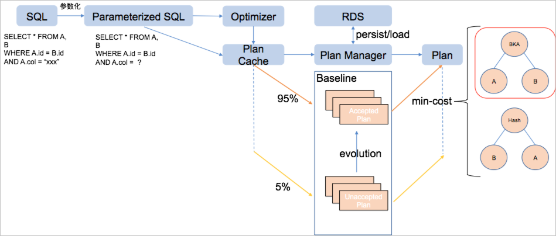
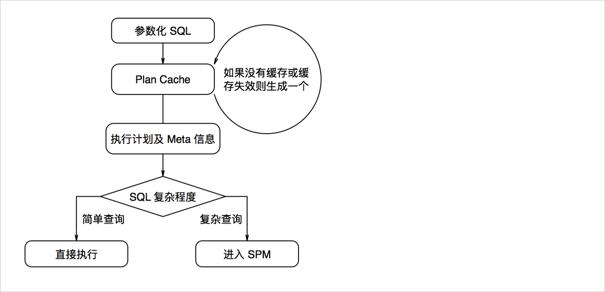
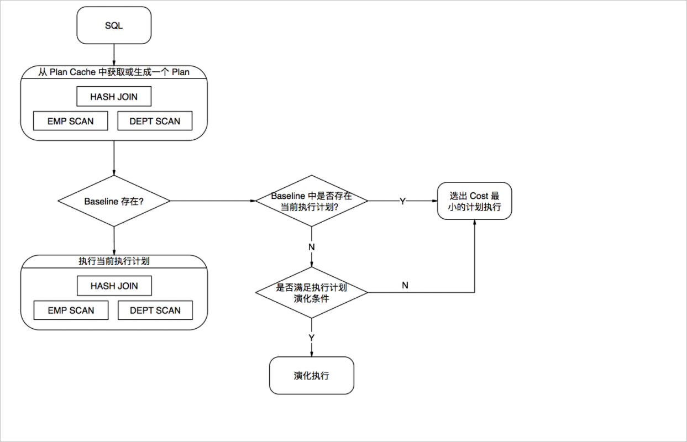

Execution plan management
===========================

This article describes how to manage the execution plan and save the execution plan of repeated or complex queries for a long time.

Background Information
-------------------------

For each SQL, the optimizer will generate a corresponding execution plan. But in many cases, the SQL requested by the application is repeated (only the parameters are different), and the SQL after parameterization is exactly the same. At this time, a cache can be constructed according to the parameterized SQL to cache various information (such as the execution plan) except the parameters, which is called the execution plan cache (Plan Cache).

On the other hand, for more complex queries (such as joins involving multiple tables), in order to keep the execution plan relatively stable, it will not change due to version upgrades and other reasons. Execution plan management (Plan Management) records a set of execution plans for each SQL, and the execution plans will be stored persistently, even if the version is upgraded.

Workflow overview
---------------------------

When PolarDB-X receives a query SQL, it will go through the following process:

1. Parameterize the query SQL and replace all parameters with the placeholder **? **

2. Use the parameterized SQL as the key to find out whether there is a cache in the execution plan cache; if not, call the optimizer for optimization.

3. If the SQL is a simple query, execute it directly, skipping the steps related to execution plan management.

4. If the SQL is a complex query, use the execution plan solidified in the Baseline; if there are more than one, choose the one with the lowest cost.




execution plan cache
---------------------------

PolarDB-X enables the execution plan cache function by default. HitCache in the EXPLAIN result indicates whether the current SQL hits the execution plan cache. After the execution plan cache is enabled, PolarDB-X will parameterize the SQL. The parameterization will replace the constants in the SQL with placeholders? and build a corresponding parameter list. In the execution plan, you can also see that the SQL of the LogicalView operator contains ?.



Execution plan management
---------------------------

For complex SQL, after the execution plan cache, it will also go through the execution plan management process.

Both execution plan caching and execution plan management use parameterized SQL as the key to execute the plan. All SQL execution plans are cached in the execution plan cache, while execution plan management only processes complex query SQL. Due to the influence of specific parameters, there is not a one-to-one correspondence between the SQL template and the optimal execution plan.

In execution plan management, each SQL corresponds to a baseline, and each baseline contains one or more execution plans. In actual use, the execution plan with the least cost will be selected for execution according to the parameters at that time. When the execution plan in the execution plan cache enters the execution plan management, SPM will operate a process to judge whether the execution plan is known, if it is known, whether the cost is the smallest; if it is not known, whether it needs to be executed To judge the optimization degree of the execution plan.



**Operation and Maintenance Instructions**

PolarDB-X provides a rich instruction set for managing execution plans. The syntax is as follows:

```sql
BASELINE (LOAD|PERSIST|CLEAR|VALIDATE|LIST|DELETE) [Signed Integer,Signed Integer....]
BASELINE (ADD|FIX) SQL (HINT Select Statement)
```


* BASELINE (ADD|FIX) SQL \<HINT\> \<Select Statement\>: Fix the execution plan record after SQL is repaired with HINT.

* BASELINE LOAD: Refresh the baseline information specified in the system table to the memory and make it take effect.

* BASELINE LOAD_PLAN: Refresh the execution plan information specified in the system table to the memory and make it take effect.

* BASELINE LIST: List all current baseline information.

* BASELINE PERSIST: Put the specified baseline into the disk.

* BASELINE PERSIST_PLAN: Place the specified execution plan on the disk.

* BASELINE CLEAR: Clear a baseline in memory.

* BASELINE CLEAR_PLAN: Clear an execution plan in memory.

* BASELINE DELETE: Delete a baseline from disk.

* BASELINE DELETE_PLAN: Delete an execution plan from the disk.


**Execution plan tuning practice**

After the data changes or the PolarDB-X optimizer engine is upgraded, a better execution plan may appear for the same SQL. During automatic evolution, SPM will add the better execution plan automatically discovered by CBO optimization to the SQL baseline. In addition, you can also actively optimize the execution plan through SPM instructions.

```sql
SELECT *
FROM lineitem JOIN part ON l_partkey=p_partkey
WHERE p_name LIKE '%green%';
```

Normal EXPLAIN found that the execution plan generated by the SQL uses Hash Join, and in the baseline of the Baseline List, the SQL only has this execution plan:

```sql
mysql> explain select * from lineitem join part on l_partkey=p_partkey where p_name like '%geen%';
+----------------------------------------------------------------------------------------------------------------------------------------------------------------------------------------------------------------------------------------------------------------------------------------------------------------------------------------------------------------+
| LOGICAL PLAN                                                                                                                                                                                                                                                                                                                                                   |
+----------------------------------------------------------------------------------------------------------------------------------------------------------------------------------------------------------------------------------------------------------------------------------------------------------------------------------------------------------------+
| Gather(parallel=true)                                                                                                                                                                                                                                                                                                                                          |
|   ParallelHashJoin(condition="l_partkey = p_partkey", type="inner")                                                                                                                                                                                                                                                                                            |
|     LogicalView(tables="[00-03].lineitem", shardCount=4, sql="SELECT `l_orderkey`, `l_partkey`, `l_suppkey`, `l_linenumber`, `l_quantity`, `l_extendedprice`, `l_discount`, `l_tax`, `l_returnflag`, `l_linestatus`, `l_shipdate`, `l_commitdate`, `l_receiptdate`, `l_shipinstruct`, `l_shipmode`, `l_comment` FROM `lineitem` AS `lineitem`", parallel=true) |
|     LogicalView(tables="[00-03].part", shardCount=4, sql="SELECT `p_partkey`, `p_name`, `p_mfgr`, `p_brand`, `p_type`, `p_size`, `p_container`, `p_retailprice`, `p_comment` FROM `part` AS `part` WHERE (`p_name` LIKE ?)", parallel=true)                                                                                                                    |
| HitCache:true                                                                                                                                                                                                                                                                                                                                                  |
|                                                                                                                                                                                                                                                                                                                                                                |
|                                                                                                                                                                                                                                                                                                                                                                |
+----------------------------------------------------------------------------------------------------------------------------------------------------------------------------------------------------------------------------------------------------------------------------------------------------------------------------------------------------------------+
7 rows in set (0.06 sec)
mysql> baseline list;
+-------------+--------------------------------------------------------------------------------+------------+--------------------------------------------------------------------------------------------------------------------------------------------------------------------------------------------------------------------------------------------------------------------------------------------------------------------------------------------------------------------------------------------------------------------------------------------------------------------------------------------------------------------------------------------------------------------------------------------------------------------------------------------------------------------------------------------------------+-------+----------+
| BASELINE_ID | PARAMETERIZED_SQL                                                              | PLAN_ID    | EXTERNALIZED_PLAN                                                                                                                                                                                                                                                                                                                                                                                                                                                                                                                                                                                                                                                                                      | FIXED | ACCEPTED |
+-------------+--------------------------------------------------------------------------------+------------+--------------------------------------------------------------------------------------------------------------------------------------------------------------------------------------------------------------------------------------------------------------------------------------------------------------------------------------------------------------------------------------------------------------------------------------------------------------------------------------------------------------------------------------------------------------------------------------------------------------------------------------------------------------------------------------------------------+-------+----------+
|  -399023558 | SELECT *
FROM lineitem
JOIN part ON l_partkey = p_partkey
WHERE p_name LIKE ? | -935671684 |
Gather(parallel=true)
ParallelHashJoin(condition="l_partkey = p_partkey", type="inner")
LogicalView(tables="[00-03].lineitem", shardCount=4, sql="SELECT `l_orderkey`, `l_partkey`, `l_suppkey`, `l_linenumber`, `l_quantity`, `l_extendedprice`, `l_discount`, `l_tax`, `l_returnflag`, `l_linestatus`, `l_shipdate`, `l_commitdate`, `l_receiptdate`, `l_shipinstruct`, `l_shipmode`, `l_comment` FROM `lineitem` AS `lineitem`", parallel=true)
LogicalView(tables="[00-03].part", shardCount=4, sql="SELECT `p_partkey`, `p_name`, `p_mfgr`, `p_brand`, `p_type`, `p_size`, `p_container`, `p_retailprice`, `p_comment` FROM `part` AS `part` WHERE (`p_name` LIKE ?)", parallel=true)
|     0 |        1 |
+-------------+--------------------------------------------------------------------------------+------------+--------------------------------------------------------------------------------------------------------------------------------------------------------------------------------------------------------------------------------------------------------------------------------------------------------------------------------------------------------------------------------------------------------------------------------------------------------------------------------------------------------------------------------------------------------------------------------------------------------------------------------------------------------------------------------------------------------+-------+----------+
1 row in set (0.02 sec)
```

If the SQL uses BKA Join (Lookup Join) under certain conditions, it will have better performance, then first you need to find a way to use HINT to guide PolarDB-X to generate an execution plan that meets expectations. The HINT format of BKA Join is:

```sql
/*+TDDL:BKA_JOIN(lineitem, part)*/
```

Whether the execution plan observed through `EXPLAIN [HINT] [SQL]` meets expectations:

```sql
mysql> explain /*+TDDL:bka_join(lineitem, part)*/ select * from lineitem join part on l_partkey=p_partkey where p_name like '%geen%';
+----------------------------------------------------------------------------------------------------------------------------------------------------------------------------------------------------------------------------------------------------------------------------------------------------------------------------------------------------------------+
| LOGICAL PLAN                                                                                                                                                                                                                                                                                                                                                   |
+----------------------------------------------------------------------------------------------------------------------------------------------------------------------------------------------------------------------------------------------------------------------------------------------------------------------------------------------------------------+
| Gather(parallel=true)                                                                                                                                                                                                                                                                                                                                          |
|   ParallelBKAJoin(condition="l_partkey = p_partkey", type="inner")                                                                                                                                                                                                                                                                                             |
|     LogicalView(tables="[00-03].lineitem", shardCount=4, sql="SELECT `l_orderkey`, `l_partkey`, `l_suppkey`, `l_linenumber`, `l_quantity`, `l_extendedprice`, `l_discount`, `l_tax`, `l_returnflag`, `l_linestatus`, `l_shipdate`, `l_commitdate`, `l_receiptdate`, `l_shipinstruct`, `l_shipmode`, `l_comment` FROM `lineitem` AS `lineitem`", parallel=true) |
|     Gather(concurrent=true)                                                                                                                                                                                                                                                                                                                                    |
|       LogicalView(tables="[00-03].part", shardCount=4, sql="SELECT `p_partkey`, `p_name`, `p_mfgr`, `p_brand`, `p_type`, `p_size`, `p_container`, `p_retailprice`, `p_comment` FROM `part` AS `part` WHERE (`p_name` LIKE ?)")                                                                                                                                 |
| HitCache:false                                                                                                                                                                                                                                                                                                                                                 |
|                                                                                                                                                                                                                                                                                                                                                                |
|                                                                                                                                                                                                                                                                                                                                                                |
+----------------------------------------------------------------------------------------------------------------------------------------------------------------------------------------------------------------------------------------------------------------------------------------------------------------------------------------------------------------+
8 rows in set (0.14 sec)
```

At this time, due to the intervention of Hint, the Join algorithm has been revised to BKA Join. But this will not change the baseline. If you want to use the above plan every time you encounter this SQL, you need to add it to the baseline.

You can use the Baseline Add command of execution plan management to add an execution plan for the SQL. In this way, two sets of execution plans will exist in the SQL baseline at the same time, and the CBO optimizer will select an execution plan to execute according to the cost.

```sql
mysql> baseline add sql /*+TDDL:bka_join(lineitem, part)*/ select * from lineitem join part on l_partkey=p_partkey where p_name like '%geen%';
+-------------+--------+
| BASELINE_ID | STATUS |
+-------------+--------+
|  -399023558 | OK     |
+-------------+--------+
1 row in set (0.09 sec)
mysql> baseline list;
+-------------+--------------------------------------------------------------------------------+-------------+----------------------------------------------------------------------------------------------------------------------------------------------------------------------------------------------------------------------------------------------------------------------------------------------------------------------------------------------------------------------------------------------------------------------------------------------------------------------------------------------------------------------------------------------------------------------------------------------------------------------------------------------------------------------------------------------------------------------+-------+----------+
| BASELINE_ID | PARAMETERIZED_SQL                                                              | PLAN_ID     | EXTERNALIZED_PLAN                                                                                                                                                                                                                                                                                                                                                                                                                                                                                                                                                                                                                                                                                                    | FIXED | ACCEPTED |
+-------------+--------------------------------------------------------------------------------+-------------+----------------------------------------------------------------------------------------------------------------------------------------------------------------------------------------------------------------------------------------------------------------------------------------------------------------------------------------------------------------------------------------------------------------------------------------------------------------------------------------------------------------------------------------------------------------------------------------------------------------------------------------------------------------------------------------------------------------------+-------+----------+
|  -399023558 | SELECT *
FROM lineitem
JOIN part ON l_partkey = p_partkey
WHERE p_name LIKE ? | -1024543942 |
Gather(parallel=true)
ParallelBKAJoin(condition="l_partkey = p_partkey", type="inner")
LogicalView(tables="[00-03].lineitem", shardCount=4, sql="SELECT `l_orderkey`, `l_partkey`, `l_suppkey`, `l_linenumber`, `l_quantity`, `l_extendedprice`, `l_discount`, `l_tax`, `l_returnflag`, `l_linestatus`, `l_shipdate`, `l_commitdate`, `l_receiptdate`, `l_shipinstruct`, `l_shipmode`, `l_comment` FROM `lineitem` AS `lineitem`", parallel=true)
Gather(concurrent=true)
LogicalView(tables="[00-03].part", shardCount=4, sql="SELECT `p_partkey`, `p_name`, `p_mfgr`, `p_brand`, `p_type`, `p_size`, `p_container`, `p_retailprice`, `p_comment` FROM `part` AS `part` WHERE (`p_name` LIKE ?)")
|     0 |        1 |
|  -399023558 | SELECT *
FROM lineitem
JOIN part ON l_partkey = p_partkey
WHERE p_name LIKE ? |  -935671684 |
Gather(parallel=true)
ParallelHashJoin(condition="l_partkey = p_partkey", type="inner")
LogicalView(tables="[00-03].lineitem", shardCount=4, sql="SELECT `l_orderkey`, `l_partkey`, `l_suppkey`, `l_linenumber`, `l_quantity`, `l_extendedprice`, `l_discount`, `l_tax`, `l_returnflag`, `l_linestatus`, `l_shipdate`, `l_commitdate`, `l_receiptdate`, `l_shipinstruct`, `l_shipmode`, `l_comment` FROM `lineitem` AS `lineitem`", parallel=true)
LogicalView(tables="[00-03].part", shardCount=4, sql="SELECT `p_partkey`, `p_name`, `p_mfgr`, `p_brand`, `p_type`, `p_size`, `p_container`, `p_retailprice`, `p_comment` FROM `part` AS `part` WHERE (`p_name` LIKE ?)", parallel=true)
|     0 |        1 |
+-------------+--------------------------------------------------------------------------------+-------------+----------------------------------------------------------------------------------------------------------------------------------------------------------------------------------------------------------------------------------------------------------------------------------------------------------------------------------------------------------------------------------------------------------------------------------------------------------------------------------------------------------------------------------------------------------------------------------------------------------------------------------------------------------------------------------------------------------------------+-------+----------+
2 rows in set (0.03 sec)
```


Through the results displayed by the above `Baseline List` command, we can see that the execution plan based on BKA_JOIN has been added to the baseline of the SQL. At this time, EXPLAIN this SQL, and found that PolarDB-X will choose different execution plans as the condition of `p_name LIKE ?` in the SQL changes. If you want PolarDB-X to use the above execution plan (instead of choosing one of the two), you can use the `Baseline Fix` command to force PolarDB-X to follow the specified execution plan.

```sql
mysql> baseline fix sql /*+TDDL:bka_join(lineitem, part)*/ select * from lineitem join part on l_partkey=p_partkey where p_name like '%geen%';
+-------------+--------+
| BASELINE_ID | STATUS |
+-------------+--------+
|  -399023558 | OK     |
+-------------+--------+
1 row in set (0.07 sec)
mysql> baseline list\G
*************************** 1. row ***************************
BASELINE_ID: -399023558
PARAMETERIZED_SQL: SELECT *
FROM lineitem
JOIN part ON l_partkey = p_partkey
WHERE p_name LIKE ?
PLAN_ID: -1024543942
EXTERNALIZED_PLAN:
Gather(parallel=true)
ParallelBKAJoin(condition="l_partkey = p_partkey", type="inner")
LogicalView(tables="[00-03].lineitem", shardCount=4, sql="SELECT `l_orderkey`, `l_partkey`, `l_suppkey`, `l_linenumber`, `l_quantity`, `l_extendedprice`, `l_discount`, `l_tax`, `l_returnflag`, `l_linestatus`, `l_shipdate`, `l_commitdate`, `l_receiptdate`, `l_shipinstruct`, `l_shipmode`, `l_comment` FROM `lineitem` AS `lineitem`", parallel=true)
Gather(concurrent=true)
LogicalView(tables="[00-03].part", shardCount=4, sql="SELECT `p_partkey`, `p_name`, `p_mfgr`, `p_brand`, `p_type`, `p_size`, `p_container`, `p_retailprice`, `p_comment` FROM `part` AS `part` WHERE (`p_name` LIKE ?)")
FIXED: 1
ACCEPTED: 1
*************************** 2. row ***************************
BASELINE_ID: -399023558
PARAMETERIZED_SQL: SELECT *
FROM lineitem
JOIN part ON l_partkey = p_partkey
WHERE p_name LIKE ?
PLAN_ID: -935671684
EXTERNALIZED_PLAN:
Gather(parallel=true)
ParallelHashJoin(condition="l_partkey = p_partkey", type="inner")
LogicalView(tables="[00-03].lineitem", shardCount=4, sql="SELECT `l_orderkey`, `l_partkey`, `l_suppkey`, `l_linenumber`, `l_quantity`, `l_extendedprice`, `l_discount`, `l_tax`, `l_returnflag`, `l_linestatus`, `l_shipdate`, `l_commitdate`, `l_receiptdate`, `l_shipinstruct`, `l_shipmode`, `l_comment` FROM `lineitem` AS `lineitem`", parallel=true)
LogicalView(tables="[00-03].part", shardCount=4, sql="SELECT `p_partkey`, `p_name`, `p_mfgr`, `p_brand`, `p_type`, `p_size`, `p_container`, `p_retailprice`, `p_comment` FROM `part` AS `part` WHERE (`p_name` LIKE ?)", parallel=true)
FIXED: 0
ACCEPTED: 1
2 rows in set (0.01 sec)
```


After the `Baseline Fix` command is executed, you can see that the `Fix` status bit of the BKA Join execution plan has been set to 1. Even if HINT is not added at this time, the SQL Explain will definitely use this execution plan under any condition.

```sql
mysql> explain select * from lineitem join part on l_partkey=p_partkey where p_name like '%green%';
+----------------------------------------------------------------------------------------------------------------------------------------------------------------------------------------------------------------------------------------------------------------------------------------------------------------------------------------------------------------+
| LOGICAL PLAN                                                                                                                                                                                                                                                                                                                                                   |
+----------------------------------------------------------------------------------------------------------------------------------------------------------------------------------------------------------------------------------------------------------------------------------------------------------------------------------------------------------------+
| Gather(parallel=true)                                                                                                                                                                                                                                                                                                                                          |
|   ParallelBKAJoin(condition="l_partkey = p_partkey", type="inner")                                                                                                                                                                                                                                                                                             |
|     LogicalView(tables="[00-03].lineitem", shardCount=4, sql="SELECT `l_orderkey`, `l_partkey`, `l_suppkey`, `l_linenumber`, `l_quantity`, `l_extendedprice`, `l_discount`, `l_tax`, `l_returnflag`, `l_linestatus`, `l_shipdate`, `l_commitdate`, `l_receiptdate`, `l_shipinstruct`, `l_shipmode`, `l_comment` FROM `lineitem` AS `lineitem`", parallel=true) |
|     Gather(concurrent=true)                                                                                                                                                                                                                                                                                                                                    |
|       LogicalView(tables="[00-03].part", shardCount=4, sql="SELECT `p_partkey`, `p_name`, `p_mfgr`, `p_brand`, `p_type`, `p_size`, `p_container`, `p_retailprice`, `p_comment` FROM `part` AS `part` WHERE (`p_name` LIKE ?)")                                                                                                                                 |
| HitCache:true                                                                                                                                                                                                                                                                                                                                                  |
+----------------------------------------------------------------------------------------------------------------------------------------------------------------------------------------------------------------------------------------------------------------------------------------------------------------------------------------------------------------+
8 rows in set (0.01 sec)
```


