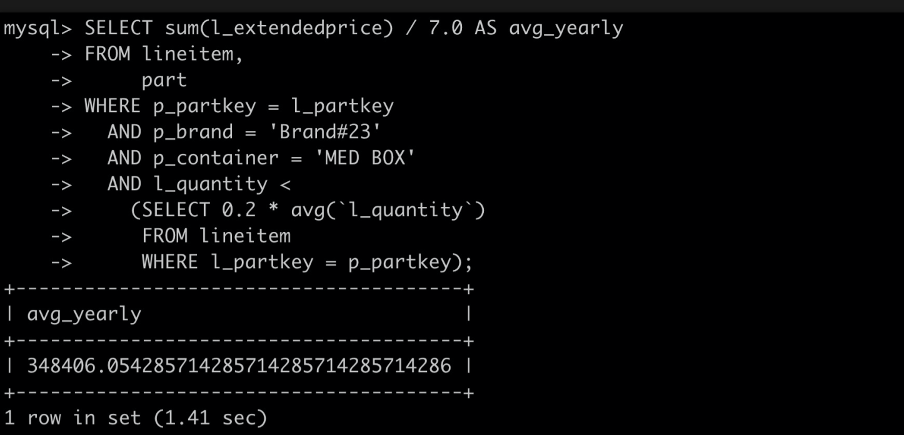

Index recommendation
===========================

Index optimization usually depends on the operation and maintenance or developers' deep understanding of the internal optimization and execution principles of the database engine. In order to optimize the experience and lower the operating threshold, PolarDB-X has introduced the index recommendation function based on the cost optimizer, which can analyze and recommend indexes based on query statements, helping you reduce query time consumption and improve database performance.

Precautions
-------------------------

The index recommendation function analyzes and recommends only the SQL query statement you currently specify. Before creating an index based on the recommended information, you need to evaluate the impact of creating the index on other queries.

Environmental description
-------------------------

TPC-H is a commonly used benchmark test method in the industry. It is formulated and released by the TPC Committee and is used to evaluate the analytical query capabilities of databases. The TPC-H benchmark test method includes 8 data tables and 22 complex SQL queries (ie Q1\~Q22). The figure below shows the return information of executing Q17 (small order revenue query) in TPC-H. It can be seen that the time spent executing this query statement is 28.76 seconds. This article will use the index recommendation function to optimize the execution efficiency of the query statement.

1. **Query index recommendation information**

To query the index recommendation information of a certain query statement, you only need to add the EXPLAIN ADVISOR command before the query statement, as shown in the following example:

```sql
EXPLAIN ADVISOR
SELECT sum(l_extendedprice) / 7.0 AS avg_yearly
FROM lineitem,
part
WHERE p_partkey = l_partkey
AND p_brand = 'Brand#23'
AND p_container = 'MED BOX'
AND l_quantity <
(SELECT 0.2 * avg(`l_quantity`)
FROM lineitem
WHERE l_partkey = p_partkey);
```

After executing the above command, PolarDB-X will return information such as the recommended index creation statement, the cost before and after adding the index, etc. The detailed return information and its notes are as follows:
**illustrate**
* In this case, the estimated disk I/O improvement percentage is 3024.7%, indicating that using the recommended index will bring greater benefits.

* When PolarDB-X cannot recommend an index, the returned information will suggest that you execute the Analyze Table command on the target table to refresh the statistical information during the off-peak period (this operation will consume large I/O resources). When the statistics are updated, perform index recommendation again to obtain more accurate indexes. SQL copy code.

```sql
IMPROVE_VALUE: 2465.3% # Expected comprehensive price increase percentage
IMPROVE_CPU: 59377.4% # Expected CPU improvement percentage
IMPROVE_MEM: 0.4% # Expected memory improvement percentage
IMPROVE_IO: 3024.7% # Expected disk I/O improvement percentage
IMPROVE_NET: 2011.1% # Expected network transmission improvement percentage
BEFORE_VALUE: 4.711359845E8 # Comprehensive cost value before adding index
BEFORE_CPU: 1.19405577E7 #CPU estimation value before adding index
BEFORE_MEM: 426811.2 # Estimation of memory consumption before adding indexes
BEFORE_IO: 44339 # Disk I/O estimate before adding index
BEFORE_NET: 47.5 # Estimated value of network transfer before adding index
AFTER_VALUE: 1.83655008E7 # Comprehensive cost value after adding index
AFTER_CPU: 20075.8 # CPU estimate after adding index
AFTER_MEM: 425016 # Estimation of memory consumption after adding indexes
AFTER_IO: 1419 # Disk I/O estimate after adding indexes
AFTER_NET: 2.2 # Network transfer estimate after adding index
ADVISE_INDEX: ALTER TABLE `lineitem` ADD  INDEX `__advise_index_lineiteml_partkey`(`l_partkey`);
/* The content in ADVISE_INDEX is the recommended index creation statement */
NEW_PLAN: # Estimated execution plan after adding indexes
Project(avg_yearly="$f0 / ?0")
HashAgg($f0="SUM(l_extendedprice)")
Filter(condition="l_quantity < $16 * f17w0$o0")
SortWindow(p_partkey="p_partkey", l_partkey="l_partkey", l_quantity="l_quantity", l_extendedprice="l_extendedprice", $16="$16", f5w0$o0="window#0AVG($2)", Reference Windows="window#0=window(partition {1} order by [] range between UNBOUNDED PRECEDING and UNBOUNDED PRECEDING aggs [AVG($2)])")
MemSort(sort="l_partkey ASC")
BKAJoin(condition="l_partkey = p_partkey", type="inner")
Gather(concurrent=true)
LogicalView(tables="[0000,0001].part", shardCount=2, sql="SELECT `p_partkey` FROM `part` AS `part` WHERE ((`p_brand` = ?) AND (`p_container` = ?))")
Gather(concurrent=true)
LogicalView(tables="[0000,0001].lineitem", shardCount=2, sql="SELECT `l_partkey`, `l_quantity`, `l_extendedprice`, ? AS `$16` FROM `lineitem` AS `lineitem` WHERE (`l_partkey` IN (...))")
INFO: LOCAL_INDEX # other information
```


2. **Create index based on recommended information**
1. Evaluate the benefits of creating the index, and then create the index based on the SQL statement in the returned result ADVISE_INDEX.

```sql
ALTER TABLE `lineitem` ADD  INDEX `__advise_index_lineiteml_partkey`(`l_partkey`);
```


2. Execute Q17 (small order revenue query) in TPC-H again, the time-consuming is reduced to 1.41 seconds, and the query efficiency is greatly improved.




